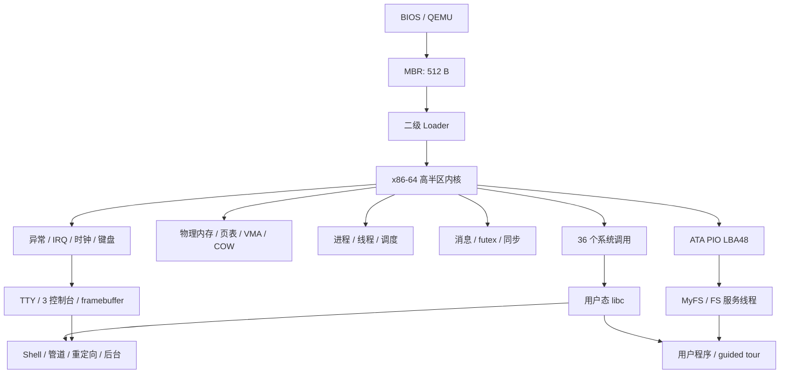

# Orange/64 操作系统设计与实现报告

## 摘要

Orange/64 是一个面向 x86-64/QEMU 的单核教学操作系统。项目从 512 字节 MBR 开始，
经过二级 Loader 完成磁盘读取、E820 内存探测、页表搭建和长模式切换，随后进入高半区
内核。内核实现中断与异常、物理/虚拟内存、抢占式线程调度、Ring 3 进程、ELF 加载、
`fork/exec/wait`、写时复制、匿名内存映射、进程间消息、futex 及用户态同步原语、
ATA PIO LBA48、MyFS、TTY 和系统调用。用户态提供轻量 libc、交互式 Shell、管道、
重定向、后台任务和多个演示/测试程序。

项目参考《Orange'S：一个操作系统的实现》的渐进式路线，但没有逐行移植书中 32 位
实现，而是围绕 64 位模式、现代 `SYSCALL/SYSRET`、独立地址空间和可自动验证的
系统行为重新设计。当前完整测试 16/16 通过，另有 100 轮同步压力测试通过。

关键词：x86-64；自制操作系统；Ring 3；COW；IPC；MyFS；TTY；QEMU

## 1. 项目背景与目标

课程要求包括引导程序、核心代码、文件系统和控制台，并重点考查文档源码、难度工作量、
答辩与考勤。本项目将目标分为四层：

1. 能从裸磁盘镜像自行启动，不依赖 GRUB 或宿主操作系统运行时。
2. 建立用户态隔离和可用的进程、线程、内存与系统调用模型。
3. 形成可交互的持久化系统：磁盘、文件系统、终端、Shell 和用户程序闭环。
4. 不只展示“能启动”，还要给出确定性测试、压力测试、持久化与异常隔离证据。

本项目定位为 A 级目标候选：功能范围覆盖简单操作系统的主要构件。最终等级仍由教师依据
答辩、真实贡献和代码理解程度评定，代码量统计不能替代原创性证明。

## 2. 参考版本与设计关系

本报告采用公开可核验的 2009 年版《Orange'S：一个操作系统的实现》，作者于渊，
ISBN 978-7-121-08442-3。出版社作者自序称其为《自己动手写操作系统》的第二版，
并说明其路线从简单引导扇区逐步形成小型操作系统。公开检索未发现该书更晚正式版次，
因此将此版作为“最新版次”对照基线。

参考资料：

- [出版社作者自序](https://www.cnblogs.com/broadview/archive/2009/05/19/1459823.html)
- [ISBN 与出版日期记录](https://www.tenlong.com.tw/products/9787121084423)

继承的是实现路线和可比较概念：Boot/Loader、保护机制、中断、进程、IPC、TTY、文件系统
与用户程序；升级或重构的是 64 位执行模式、地址空间、系统调用 ABI、磁盘容量、VM、
自动化测试和交互体验。

## 3. 总体架构

系统采用单核、分层内核结构。进程与线程分离：进程保存地址空间、文件描述符、当前目录和
子进程关系，线程保存调度上下文、内核栈、用户栈、TLS 与阻塞状态。文件系统请求通过
内核服务线程串行执行，TTY 也使用内核队列隔离 IRQ 和可能阻塞的用户请求。

## 4. 启动与 Loader

### 4.1 磁盘布局

| 区域 | 默认位置 | 用途 |
|---|---:|---|
| MBR | LBA 0 | BIOS 加载并执行，预读 Loader 窗口和内核前 42 扇区 |
| Loader | LBA 2 起 | 探测显示模式、预读内核、建页表、进入长模式 |
| 内核 | LBA 10 起 | 按构建时计算的实际扇区数加载 |
| MyFS | LBA 1000 起 | 超级块、位图、inode 表、数据区 |

原实现把 Loader 尾部读取固定为 188 个扇区，内核增长后可能静默截断。当前构建流程读取
`kernel.bin` 的实际字节数，向 NASM 注入 `KERNEL_SECTORS`，Loader 先使用预加载的
42 个扇区，再精确读取尾部；当一次 ATA 命令超过 255 个扇区时自动分块。构建还执行两重
边界检查：内核磁盘区域不能碰到 LBA 1000 的 MyFS，内核加载后含 `.bss` 的物理末端不能
碰到 `0x70000` 的启动页表。

### 4.2 长模式与高半区

Loader 建立临时页表并开启 PAE、EFER.LME 与分页，随后跳入 64 位入口。链接脚本把内核
映射到高半区，同时保留可由 Loader 加载的物理布局。内核入口显式清零 `.bss`，不依赖
磁盘镜像恰好包含零填充，消除了静态对象初值不确定的问题。

## 5. 中断、异常与设备输入

GDT/TSS 提供内核态和用户态段及 Ring 3 进入 Ring 0 时的栈切换。IDT 覆盖 CPU 异常、
时钟和键盘 IRQ。用户进程触发的页错误会转换为进程退出状态，内核错误才进入 panic，
因此 `fault.elf` 崩溃后 Shell 仍可继续运行。

键盘路径从 8042 控制器读扫描码、送入键盘缓冲，再由 TTY/Shell 消费。为解决自动输入或
渲染繁忙时的漏字问题，IRQ 现在会在一次中断中排空控制器输出缓冲（设 64 字节安全上限）
再确认 PIC；输入压力测试会验证字符顺序、编辑键和命令完整性。

## 6. 内存管理

物理内存管理器维护页帧分配与引用计数；虚拟内存层负责四级页表、映射、权限和页错误。
每个用户进程拥有独立 CR3。主要能力包括：

- ELF 段按权限装入独立用户空间；内核高半区映射由所有进程共享。
- `fork` 复制进程结构与用户页表，把可写私有页改为只读 COW 并增加引用计数。
- 写入 COW 页时，若多人共享则复制物理页；若引用计数为 1 则直接恢复写权限。
- 匿名私有 `mmap/munmap` 由 VMA 描述并在调用时分配页面；ELF 用户栈通过
  `VM_GROWSDOWN` 在缺页时按页增长。
- 用户指针在系统调用边界检查并复制，避免内核直接长期持有用户缓冲。

guided tour 用父页 `0x1111`、子页 `0x2222`、父进程仍为 `0x1111` 的可观察结果证明 COW，
而不仅是在 PPT 上声称实现。

## 7. 进程、线程与调度

系统提供内核线程和用户进程，时钟中断驱动单核抢占式调度。进程支持 `spawn`、`fork`、
`exec`、`exit`、`wait`、`kill` 和 `ps`；线程支持 create/join/detach/exit/yield，并为每个
线程分配独立用户栈和 TLS。父子进程、僵尸回收和孤儿回收有明确生命周期。

用户线程共享进程地址空间和文件表。内核用 spinlock 保护短临界区；用户态互斥锁、条件
变量和 TLS 基于 futex 等系统调用实现。同步用例在 4 个线程间共享计数器，核心回归运行
10 轮 × 每线程 20,000 次，独立压力门运行 100 轮。

## 8. IPC 与系统调用

系统通过 x86-64 `SYSCALL/SYSRET` 进入和离开内核。入口保存用户返回现场、切换 GS 与
内核栈，分发器完成编号校验和参数复制。36 个系统调用按功能分组如下：

| 类别 | 系统调用 |
|---|---|
| 基础 I/O | `write`, `read`, `clear`, `get_ticks`, `sleep` |
| 文件与目录 | `open`, `close`, `unlink`, `list`, `mkdir`, `stat`, `chdir`, `getcwd` |
| 进程 | `spawn`, `exec`, `fork`, `exit`, `wait`, `getpid`, `kill`, `ps` |
| 线程 | `thread_create`, `thread_join`, `thread_exit`, `gettid`, `thread_detach`, `thread_yield` |
| 同步/IPC | `send`, `receive`, `futex_wait`, `futex_wake` |
| 虚拟内存 | `mmap`, `munmap` |
| 文件描述符 | `dup`, `dup2`, `pipe` |

进程消息包含来源 PID、类型和值，发送和接收可阻塞并由调度器唤醒。guided tour 创建子进程，
父进程发送 `0xC0DE`，子进程校验来源并回复，再由退出状态完成端到端证明。

## 9. 磁盘与 MyFS

ATA 驱动使用 PIO 与 LBA48，可寻址范围不再受 LBA28 限制。MyFS 以 4 KiB 为块，磁盘
格式版本为 4，超级块记录 inode 位图、数据位图、inode 表与数据区位置。inode 为固定
72 字节，包含 11 个直接指针和一、二、三级间接索引；目录项固定 64 字节。

已实现绝对/相对路径、层级目录、`open/read/write/close/unlink/list/stat/mkdir/chdir/getcwd`、
文件描述符共享对象和 offset、`dup/dup2` 以及管道所需的统一 I/O 抽象。宿主机 `mkfs`
按镜像实际大小计算布局，并检查超容量和 LBA48 边界。演示程序创建 `demo-proof.txt`，退出
QEMU 后再次启动仍能读取，用来证明数据来自磁盘而非内核内存。

## 10. TTY、显示与 Shell

系统提供三套虚拟控制台、滚屏历史、光标与键盘编辑。默认交互后端是 QEMU framebuffer，
支持 1024×768、1280×720 和 1440×900；VGA 文本模式作为回退及自动测试镜像。TTY 与
Shell 支持 Ctrl+L、Ctrl+U、Ctrl+W、方向键、Home/End、PageUp/PageDown、F1/F2/F3、
历史记录和 Tab 补全。

用户态 Shell 通过系统调用组合能力，提供内建命令、外部 ELF 程序、参数传递、当前目录、
管道 `|`、输入/输出重定向和后台 `&`。这证明文件描述符、进程、wait、pipe、exec 和 TTY
前台控制能够协同，而不是只存在彼此隔离的内核函数。

## 11. 用户态与 guided tour

用户态包含启动代码、系统调用封装、轻量 libc、Shell、`ls/cat/echo/mkdir/rm/pwd/ps/sleep/kill`
等工具，以及 VM、IPC、线程、同步、FS、非法访问等演示程序。`demo` 会运行 `showcase.elf`，
依次验证：

1. 系统观察：PID、ticks、进程、线程与用户页。
2. 进程与 COW：父子写入隔离。
3. IPC：父子消息往返。
4. 线程：4 线程、mutex、join 与退出码。
5. 文件系统：创建、写入、重开、读取、stat。
6. 故障隔离：子进程 page fault 后 Shell/演示继续。

最终输出 `RESULT 6 passed 0 failed`，每一步都同时打印 input、actual 和 expect。

## 12. 工程与测试

构建系统生成 MBR、Loader、内核 ELF/BIN、用户 ELF、文件系统镜像和磁盘镜像。测试使用
统一 manifest、临时磁盘、QEMU monitor/串口/VGA 抓取和固定随机种子，分为 fast、full、
stress 三个 profile。详细结果见[测试报告](05-测试报告.md)。

当前制品：MBR 512 B、Loader 567 B、内核 BIN 93,388 B、内核 ELF 469,416 B、默认
开发磁盘 256 MiB。制品尺寸随编译配置变化，构建边界检查比固定数字更重要。

## 13. 局限与后续工作

当前是课程级系统，不宣称是生产操作系统。明确局限包括：

- 单核，无 SMP、NUMA 与多核同步验证。
- 只面向 BIOS/QEMU/x86-64，没有 UEFI、真机硬件枚举和驱动生态。
- ATA PIO 轮询，无 DMA、缓存回写、日志文件系统、权限/用户、链接和挂载。
- 无网络栈、GUI、Unicode 字体、音频、USB 与鼠标。
- 匿名私有 `mmap` 为主，未实现完整文件映射和 swap。
- Shell 有基础后台任务，但不等同于 POSIX job control。
- Loader 加载原始内核镜像，并非通用 ELF Loader。

课程答辩应强调“完成并验证了哪些边界”，不把这些限制包装为已实现功能。若继续开发，
优先级应是文件系统一致性/日志、页缓存与文件映射、SMP，然后才是网络或 GUI。

## 14. 结论

Orange/64 已形成从裸机启动到用户应用的完整闭环，并为关键功能建立了可重复、可观察的
验证方式。相较只完成书中步骤，本项目的主要增量是 x86-64 权限模型、独立地址空间、
COW/mmap、线程同步、LBA48/层级文件系统、现代 Shell 和自动化证据链。项目仍保留清晰的
教学边界，适合作为课程设计答辩对象。
