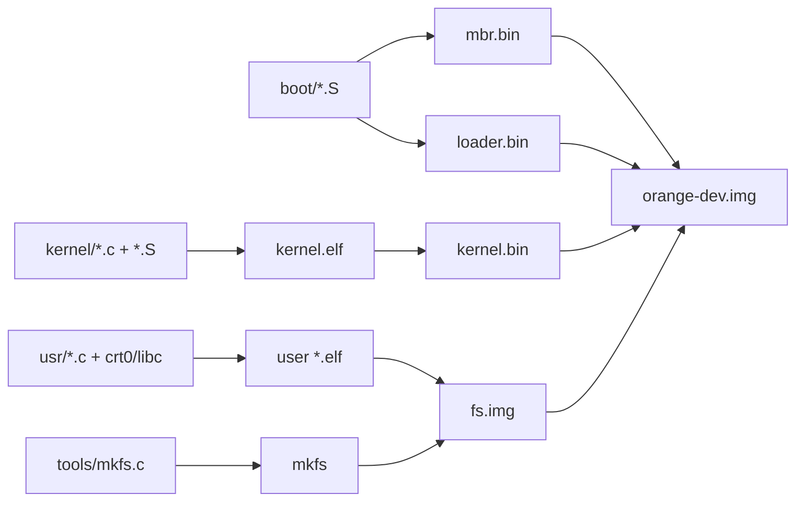
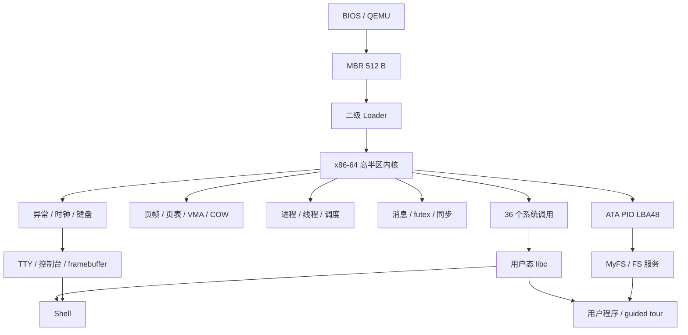

# Orange/64 操作系统设计与实现

## 操作系统课程设计项目文档

| 项目 | 内容 |
|---|---|
| 课程名称 | 操作系统课程设计 |
| 项目名称 | Orange/64 操作系统设计与实现 |
| 项目类型 | 独立完成一个简单操作系统（A 级目标） |
| 姓名 | `[姓名]` |
| 学号 | `[学号]` |
| 班级 | `[班级]` |
| 组号 | `[组号]` |
| 指导教师 | `[指导教师]` |
| 完成日期 | 2026 年 `[月]` 月 `[日]` 日 |
| 源码托管 | <https://github.com/Phantom-Lucas/orange_os> |
| 最终版本 | `[最终 commit/tag]` |

> 导出说明：本文件是 Word/PDF 的统一源稿。导出前应替换全部方括号占位符，按标题层级
> 生成三级自动目录，并启用 PDF 书签。代码来源与 AI 使用必须由本人依据真实情况确认。

---

## 原创性及工具使用说明

本项目为单人课程设计。项目目标选择、环境搭建、方案取舍、代码集成、调试、测试、验收、
文档组织和答辩准备由本人负责。开发过程参考于渊《Orange'S：一个操作系统的实现》、
处理器和工具链公开文档，并使用 AI 辅助进行设计讨论、代码草拟、问题定位、测试建议、
代码审查和文档整理。

AI 辅助或参考代码不应被描述为本人纯手写。本项目在第16章提供逐模块来源核对表，要求本人
在提交前填写：具体实现或改写内容、参考来源、AI 介入方式、可验证材料以及能否独立讲解。
代码总行数、Git 提交作者和测试通过均不能单独证明手写比例。课程关于“至少一半代码量由
项目组完成”的要求，应以教师认可的口径、真实提交历史、实质性设计与改写记录为准。

本人确认将在提交前核对上述内容，不虚构原创比例，并对最终源码、文档和答辩陈述负责。

签名：`[姓名]`　日期：`[日期]`

---

## 摘要

Orange/64 是一个面向 x86-64 与 QEMU 的单核教学操作系统。系统从 512 字节 MBR 开始，
经 MBR/二级 Loader 协作完成内核读取、E820 内存探测、临时页表建立和长模式切换，随后进入高半区
内核。内核实现 GDT/TSS/IDT、中断与异常、物理和虚拟内存、Ring 3 用户态、抢占式线程
调度、进程生命周期、ELF 加载、`fork/exec/wait`、写时复制、匿名 `mmap`、消息 IPC、
futex 及用户态同步原语、ATA PIO LBA48、MyFS、TTY、三控制台和系统调用。用户态提供启动
代码、轻量 libc、交互式 Shell、管道、重定向、后台执行和二十余个程序。

本项目参考《Orange'S：一个操作系统的实现》的渐进式实现路线，但没有把书中 32 位源码
直接作为最终结构，而是围绕 64 位执行模式、每进程独立页表、现代系统调用 ABI、文件描述符
组合和自动化测试重新组织。为解决内核增长导致 Loader 静默截断的问题，构建系统会根据
`kernel.bin` 的实际大小计算扇区数，Loader 支持超过 255 扇区的 ATA 分块读取，并同时检查
内核磁盘区域和含 `.bss` 的物理内存上界。键盘中断会排空 8042 输出缓冲，降低快速输入时的
漏字风险。

测试系统采用 manifest、固定随机种子、临时磁盘、QEMU monitor、VGA 文本抓取和 framebuffer
像素截图。当前固定种子完整回归 16/16 通过，独立同步压力测试以 100 轮、4 个线程、每线程
20,000 次共享更新通过。项目形成了从裸机启动、用户隔离、持久化存储、交互应用到可重复
测试的完整课程级闭环。

关键词：x86-64；自制操作系统；Ring 3；写时复制；进程间通信；MyFS；TTY；QEMU

---

## 阅读导航

### 快速了解路线

摘要 → 第1章项目概述 → 第3章总体设计 → 第4章 Orange'S 对照 → 第13章测试结果 →
第17章总结。适合教师在答辩前快速了解项目范围和结果。

### 技术审核路线

第5章启动 → 第7章内存 → 第8章进程线程 → 第9章系统调用与同步 → 第10章文件系统 →
第11章终端 → 第12章用户态 → 第14章问题解决。适合检查核心实现和工作量。

### 构建复现路线

第2章环境构建 → 第13章测试 → 第15章演示 → 附录D/F/G/H。适合从最终源码重新构建、
运行并核对测试证据。

### 代码阅读约定

正文中的路径均相对于仓库根目录。每个核心章节说明源码入口、关键不变量和可观察证据。
文档不粘贴大段完整源码；完整实现以最终 commit/tag 的托管仓库为准。

第2章以及第5～15章均设置了“功能—文件—函数定位”表。表中的
`文件路径::函数名` 是答辩时从功能跳转到实现的主索引；同一功能涉及多个阶段时，会依次列出
入口函数、核心处理函数和验证函数。汇编标签、链接脚本段和 Makefile 目标没有 C 函数名，因此按
`文件路径::标签/段名/目标名` 记录。附录A进一步把全部36个系统调用定位到用户态封装和内核处理链，
附录E则给出按模块阅读源码的顺序。

---

# 第1章 项目概述

> 本章目的：说明课程背景、项目目标、功能范围、工程规模和评分项对应，使读者先建立整体认识。

## 1.1 课程设计背景

课程要求完成具有操作系统性质的项目，评分综合考虑文档及源码、难度与工作量、答辩和考勤。
“独立完成一个简单的操作系统”应包含引导程序、核心代码、文件系统和控制台等模块，并要求
项目组完成足够的实质代码工作。Orange/64 选择从裸磁盘镜像启动的自制系统路线，以便把
处理器启动、内存、并发、存储、终端和用户程序连接为完整系统，而不是只完成单个实验。

## 1.2 项目目标

项目目标分为五个闭环：

1. 裸机自举：不依赖 GRUB，从自己的 MBR 和 Loader 进入 64 位内核。
2. 用户隔离：建立 Ring 3、独立地址空间、系统调用和用户异常隔离。
3. 系统并发：实现进程、线程、调度、IPC、futex 和用户态同步。
4. 持久交互：实现磁盘、文件系统、TTY、显示、Shell 和用户应用。
5. 可重复验证：用构建检查、黑盒交互、边界和压力测试形成证据链。

## 1.3 项目范围

系统面向 BIOS/QEMU/x86-64，采用 1 个虚拟 CPU。目标是课程级教学操作系统，不追求 Linux
兼容或生产部署。系统没有实现 SMP、网络、USB、音频、完整 GUI、文件系统日志、用户权限、
swap 和完整 POSIX job control。这些属于明确边界，不计为已完成功能。

## 1.4 已实现功能概览

| 领域 | 已实现功能 |
|---|---|
| 启动 | MBR、二级 Loader、E820 内存探测、A20、页表、长模式、高半区、动态内核扇区 |
| 内核基础 | GDT、TSS、IDT、时钟、键盘、异常、panic、启动日志 |
| 内存 | 页帧、四级页表、独立 CR3、引用计数、COW、VMA、匿名 mmap |
| 进程线程 | spawn、fork、exec、exit、wait、kill、ps、用户线程、TLS、抢占调度 |
| ABI/并发 | 36 个系统调用、消息 IPC、futex、mutex、condvar、pipe |
| 存储 | ATA PIO LBA48、MyFS、层级目录、三级间接索引、宿主 mkfs |
| 终端 | TTY、三控制台、滚屏、编辑、framebuffer、VGA 回退 |
| 用户态 | crt0、libc、Shell、argv、管道、重定向、后台、20 余个程序 |
| 验证 | fast/full/stress、16 项完整回归、100 轮同步压力、截图与 artifact |

## 1.5 项目主要成果

当前代码约 19,135 个物理行，统计范围为 `boot/`、`kernel/`、`usr/`、`tools/` 内的 C、
头文件、汇编和链接脚本，包含空行与注释。当前代表性制品为：MBR 512 B、Loader 567 B、
`kernel.bin` 93,388 B、`kernel.elf` 469,416 B、默认开发磁盘 256 MiB。尺寸会随配置变化，
因此构建使用动态边界检查，而不依赖报告中的固定数字。上述行数用于说明工程规模，不代表
个人原创行数。

## 1.6 项目目录结构

```text
my_os/
├── boot/       MBR 和二级 Loader
├── kernel/     内核、驱动、内存、进程、FS、TTY、显示
├── usr/        用户启动代码、libc、Shell、工具和演示程序
├── tools/      宿主机 MyFS 格式化工具
├── tests/      统一测试 runner、manifest、suite 和 QEMU 工具
├── assets/     framebuffer 使用的字体等资源
├── docs/       开发过程和阶段文档
├── design/     最终项目文档与答辩材料
├── Makefile    构建、镜像、运行、测试和展示入口
└── build/      生成制品和测试 artifact，不作为源码提交
```

## 1.7 评分项对应关系

| 评分项 | 权重 | 本项目对应材料 |
|---|---:|---|
| 文档及源码 | 30% | 本文档、源码阅读索引、最终托管链接、模块来源表 |
| 难度及工作量 | 40% | 自举、特权级、VM、并发、FS、TTY、Shell、测试体系 |
| 答辩 | 20% | 10 分钟脚本、12 页 PPT、一键 guided tour、问题库 |
| 考勤 | 10% | 由课程现场记录，本文档不替代考勤 |

## 1.8 本章小结

Orange/64 已覆盖简单操作系统的主要构件，功能范围可作为 A 级目标候选。最终评分仍取决于
真实个人贡献、源码理解、文档质量、现场演示和教师判定，不能仅依据功能数量或代码行数。

---

# 第2章 开发环境与项目构建

> 本章目的：给出已经验证的工具链、构建依赖、制品关系、运行方式和破坏性操作边界，使最终
> 源码能够由第三方在相同环境复现。

## 2.1 已验证宿主环境

| 项目 | 已验证值 |
|---|---|
| 操作系统 | Ubuntu 22.04.5 LTS x86-64 |
| Linux 内核 | 6.8.0-136-generic |
| 编译器 | GCC x86-64 freestanding 配置 |
| 汇编器 | NASM |
| 链接工具 | GNU ld、objcopy、objdump |
| 虚拟机 | `qemu-system-x86_64` |
| Guest 配置 | 1 vCPU，默认 1 GiB；展示 512 MiB |

最终版本的具体工具版本应运行 `tests/collect_env.sh` 后填入附录F。系统未声明在 Windows
原生、macOS、ARM 或真机环境通过。

## 2.2 编译与运行工具

- GCC：编译 freestanding 的内核和用户程序。
- GNU ld：按 `kernel/linker.ld` 生成内核 ELF。
- objcopy：从 ELF 提取 Loader 可直接加载的原始内核镜像。
- NASM：生成 MBR、Loader 和部分上下文切换代码。
- QEMU：模拟 x86-64 CPU、ATA、VGA/Bochs 显示设备和内存。
- GNU Make：统一管理配置、依赖、镜像布局、测试和演示。
- GDB：通过 QEMU gdb stub 调试内核 ELF 符号。

## 2.3 依赖安装

Ubuntu 22.04 可执行：

```bash
sudo apt update
sudo apt install build-essential binutils nasm make qemu-system-x86 coreutils git
```

用户程序以 `-ffreestanding -nostdlib` 构建，不链接宿主系统 libc。Guest 使用项目自己的启动
代码、系统调用封装和轻量 libc。

## 2.4 获取并固定源码版本

```bash
git clone https://github.com/Phantom-Lucas/orange_os.git
cd orange_os
git checkout '[最终答辩 tag 或 commit]'
git status --short --branch
```

提交链接必须固定到最终 tag/commit。若 `git status --short` 非空，构建结果可能无法由远程
版本复现。当前开发阶段的工作区修改应在本人审查后合入主分支，本文档不自动执行 commit、
merge、tag 或 push。

## 2.5 构建流程

```bash
make build
make check
```

构建依赖关系可以概括为：



## 2.6 构建制品

主要制品位于：

```text
build/mbr.bin
build/loader.bin
build/kernel/kernel.elf
build/kernel/kernel.bin
build/*.elf
build/mkfs
build/fs.img
build/images/orange-dev.img
```

`make check` 检查 MBR 大小与签名、Loader 大小、内核磁盘扇区容量、含 BSS 的物理末端、
用户 ELF 和 MyFS 制品。检查失败必须修复布局或实现，不能简单删除检查。

## 2.7 磁盘镜像生成

首次运行：

```bash
make bootstrap
```

该目标创建磁盘、写 MBR/Loader/内核并格式化 MyFS。`format-fs` 会覆盖目标镜像的 MyFS 区域，
已有 Guest 文件会丢失。只修改内核且希望保留文件时使用 `make run`，它只安装启动和内核区。

## 2.8 QEMU 启动方法

默认 framebuffer：

```bash
make run
```

VGA 文本回退：

```bash
make CONSOLE_BACKEND=vga run
```

支持的 framebuffer 分辨率：

```bash
make FB_MODE=1024x768 run
make FB_MODE=1280x720 run
make FB_MODE=1440x900 run
```

## 2.9 GDB 调试方法

```bash
make debug
```

另一个终端：

```text
gdb build/kernel/kernel.elf
(gdb) target remote :1234
(gdb) break kernel_main
(gdb) continue
```

`make debug` 使用 `-S -s` 让 QEMU 在启动处暂停并监听 1234 端口。需要详细启动日志时可运行：

```bash
make BOOT_DIAGNOSTIC=1 run
```

## 2.10 常见环境问题

| 现象 | 原因或处理 |
|---|---|
| 找不到 QEMU | 安装 `qemu-system-x86` |
| monitor socket 无权限 | 在允许 Unix socket 的本地环境重跑，记录为 infrastructure |
| 同步测试异常缓慢 | 检查并关闭遗留 QEMU，使用相同 seed 重跑 |
| 演示文件消失 | 检查是否误执行 `format-fs` 或 `fb-showcase-prepare` |
| 内核越界 | 按 Makefile 错误调整代码/启动布局，不能扩大常数掩盖 |
| framebuffer 空白 | 先用 VGA 回退区分启动错误和图形渲染错误 |

## 2.11 编译参数与 freestanding 约束

内核 CFLAGS 使用 `-m64 -mcmodel=large -ffreestanding -mno-red-zone`，关闭 MMX/SSE/x87，禁用
PIE/PIC、stack protector、异步 unwind 和宿主控制流保护。原因如下：

- 内核没有宿主运行时，不能让编译器隐式依赖 libc 或 ELF 动态装载器。
- 中断会使用当前内核栈，System V 允许的 red zone 在内核中不安全。
- 启动阶段未保存/恢复 SIMD/FPU 状态，所以禁止编译器自动生成相关指令。
- 高半区符号需要适合当前链接布局的 code model。
- PIE、stack protector 和 unwind 会引入项目未提供的运行时符号或重定位语义。

用户 ELF 同样使用 64 位 freestanding/nostdlib，但链接到项目自己的 crt0 和 libc。内核 ELF
保留 `-g` 符号，最终 BIN 通过 objcopy 去除 note/comment/eh_frame 等非运行段。

## 2.12 关键构建配置

| 变量 | 默认值 | 作用 |
|---|---:|---|
| `DISK_SIZE` | 256M | 开发磁盘大小 |
| `FS_START_LBA` | 1000 | MyFS 起始扇区 |
| `KERNEL_START_LBA` | 10 | 内核起始扇区 |
| `QEMU_MEMORY` | 1G | Guest 内存 |
| `QEMU_CPUS` | 1 | 单核设计约束 |
| `CONSOLE_BACKEND` | qemu-fb | 默认交互显示后端 |
| `FB_MODE` | 1280x720 | framebuffer 模式 |
| `BOOT_DIAGNOSTIC` | 0 | 启动详细日志开关 |
| `SYNC_TEST_ROUNDS` | 10 | full 同步轮数 |
| `SYNC_WORKER_ROUNDS` | 20000 | 每线程共享更新次数 |

Makefile 用配置 stamp 把编译宏写入依赖图。配置变化时必须重编相关对象，避免增量构建错误复用
另一种 framebuffer/diagnostic/FS 起点的内核。

## 2.13 构建目标的破坏性边界

| 目标 | 是否修改磁盘 | 用途 |
|---|---|---|
| `make build/check` | 生成 build 制品，不改已有 dev FS | 编译和静态检查 |
| `make install-kernel` | 写 MBR/Loader/Kernel | 保留原 MyFS |
| `make format-fs` | 覆盖 MyFS 区 | 明确重置文件系统 |
| `make bootstrap` | 安装内核并格式化 | 首次/全新开发盘 |
| `make run` | 安装内核后启动 | 日常运行，保留 FS |
| `make fb-showcase-prepare` | 重建独立演示盘 | 演示前仅执行一次 |
| `make fb-showcase` | 只启动演示盘 | 展示持久化 |
| `make test ...` | 使用独立临时盘 | 不污染开发/演示盘 |

`clean`/`clean-images` 会删除生成制品，执行前应确认需要保留的 artifact 已归档。项目提交不包含
`build/`，但报告中的测试证据需要记录生成命令和路径。

## 2.14 构建功能—文件—目标定位

| 功能 | 文件 | 目标/规则/脚本入口 |
|---|---|---|
| MBR/Loader 汇编 | `Makefile` | `$(MBR_BIN)`, `$(LOADER_BIN)` 规则 |
| 动态内核扇区/物理边界 | `Makefile` | `$(LOADER_BIN)` shell 检查段 |
| 内核 C/汇编编译 | `Makefile` | `KERNEL_CFLAGS`, `KERNEL_OBJECTS`, pattern rules |
| 内核链接/BIN | `Makefile`, `kernel/linker.ld` | `$(KERNEL_ELF)`, `$(KERNEL_BIN)` |
| 用户 ELF | `Makefile`, `usr/crt0.S`, `usr/libc.c` | `USER_APPS` 及各用户目标规则 |
| mkfs/fs.img | `Makefile`, `tools/mkfs.c` | `$(MKFS)`, `$(FS_IMAGE)` |
| 开发磁盘安装 | `Makefile` | `install-kernel`, `format-fs`, `bootstrap` |
| QEMU 运行/调试 | `Makefile` | `run`, `debug`, `showcase`, `fb-showcase` |
| 静态检查 | `Makefile`, `tests/check_build.sh` | `check` |
| 测试入口 | `Makefile`, `tests/run.sh` | `test`, `test-fast`, `test-all`, `test-stress`, `test-self` |
| 配置变更重编译 | `Makefile` | `.boot-config`, `.fs-config` stamp 规则 |
| 环境采集 | `tests/collect_env.sh` | 脚本主流程、`record_command` |

## 2.15 本章小结

项目将构建、镜像、运行、调试和测试统一在 Makefile 中，并为会破坏文件系统的操作提供明确
目标。最终提交应从干净 tag 在新目录复现，而不是只在开发工作区验证。

---

# 第3章 需求分析与总体设计

> 本章目的：把课程要求转化为功能/非功能需求，建立系统分层、初始化依赖、关键数据流、信任
> 边界和跨模块不变量。

## 3.1 功能需求

系统启动需求包括 BIOS 自举、磁盘读取、长模式和内核入口；内核需求包括异常、中断、内存、
调度、进程、线程、系统调用、IPC、存储与终端；用户态需求包括 ELF、libc、Shell、文件工具
和演示程序。验证需求包括构建边界、功能、持久化、压力、输入和显示测试。

## 3.2 非功能需求

- 可解释：核心机制能够从数据结构、状态转换和测试结果说明。
- 可复现：最终源码和固定命令可以在验证环境重新构建。
- 可观测：每项关键功能具有运行输出或外部测试证据。
- 故障隔离：用户错误不能直接导致内核 panic。
- 边界明确：未实现功能和适用环境主动记录。
- 可维护：模块接口、锁顺序、磁盘格式和测试 profile 有清晰约定。

## 3.3 系统总体架构



## 3.4 Ring 0 与 Ring 3 分层

内核、驱动、页表管理和服务线程运行在 Ring 0。Shell 与普通应用运行在 Ring 3，只能通过
系统调用访问内核资源。GDT/TSS、页表 U/S 权限与系统调用入口共同建立保护边界。用户异常
被转换为进程退出，内核异常才进入 panic。

## 3.5 系统初始化流程

```text
清零 BSS
  → 显示/日志基础
  → 物理内存与页表
  → GDT/TSS/IDT/PIC
  → 时钟与键盘
  → 进程、线程、调度
  → syscall/IPC/同步
  → ATA/MyFS/FS 服务
  → TTY/控制台
  → ELF 用户程序与 Shell
```

初始化必须满足依赖顺序。例如系统调用不能在用户态进入前缺失；调度实体不能在页表和内核栈
尚未准备时创建；MyFS 服务依赖 ATA 和线程基础设施。

## 3.6 磁盘布局

| 区域 | 默认 LBA | 用途 |
|---|---:|---|
| MBR | 0 | BIOS 首阶段 |
| Loader | 2 起 | 二级启动代码 |
| Kernel | 10 起 | 按实际大小写入和加载 |
| MyFS | 1000 起 | 超级块、位图、inode 表和数据 |

内核最大磁盘扇区数为 `FS_START_LBA - KERNEL_START_LBA`，默认 990。物理加载区的另一上界
是 `0x70000`，该处开始放置启动页表。两者分别约束磁盘和运行时物理内存。

## 3.7 进程与线程资源模型

进程保存 PID、状态、父子关系、CR3、VMA、当前目录、文件描述符表和线程链表。线程保存 TID、
调度上下文、内核栈、用户栈、TLS、优先级和阻塞状态。一个进程的线程共享地址空间和文件表，
但拥有独立执行现场。

## 3.8 关键数据流

```text
文件读取：Ring 3 read → copyin 参数 → file object → FS request → ATA → copyout
键盘输入：8042 IRQ → scancode decode → TTY queue → foreground Shell read
Shell 管道：pipe → fork → dup2 → exec → file object buffer → wait/background
COW 写入：write fault → PTE/COW 检查 → refcount → copy/remap → TLB refresh
```

## 3.9 设计取舍

系统选择单核和 QEMU 以把精力集中在操作系统核心闭环；FS/TTY 采用内核服务化组织，但不宣称
严格微内核；自动测试以 VGA 文本作为多数 case 的稳定 oracle，交互默认使用 framebuffer；
full 与 stress 分离，兼顾每次修改反馈速度和长时间并发验证。

## 3.10 需求—模块—证据追踪

| 需求 | 实现模块 | 用户可见证据 | 自动用例 |
|---|---|---|---|
| 裸机自举 | MBR/Loader/linker | 到达 Shell | boot.* |
| 用户隔离 | GDT/TSS/页表/异常 | fault 后 Shell 存活 | vm/integration |
| 多任务 | process/thread/timer | ps、后台任务 | sync/userland |
| 进程协作 | IPC/pipe/futex | demo IPC/THREADS | sync/showcase |
| 持久存储 | disk/MyFS/file | proof 跨重启 | fs/lba48 |
| 交互终端 | keyboard/TTY/FB | 编辑、切控制台 | input/editor/fb |
| 系统应用 | libc/Shell/ELF | pipe/redirection/demo | tty/userland |
| 可复现 | Makefile、tests 与 artifact | 固定命令与结果 | test-self/full |

该矩阵用于文档审核：每个功能必须能回答“代码在哪里、怎么运行、怎么判定”，否则只作为计划
或限制记录。

## 3.11 系统关键不变量

1. 磁盘布局：MBR/Loader/Kernel/MyFS 区域不能重叠。
2. 物理布局：内核含 BSS 不能覆盖启动页表和 PMM 位图。
3. 权限：用户 PTE 不得映射内核私有页，系统调用不得直接信任用户指针。
4. 调度：调度环最多一个 RUNNING；BLOCKED 不可被当 READY 切入。
5. COW：所有共享 PTE 引用与 PMM refcount 相等，写页必须只读+COW。
6. 生命周期：zombie 只回收一次；文件、pipe、futex、IPC 等待都在退出时解除。
7. 锁顺序：address-space、heap、PMM 及 bucket/file 锁按约定顺序获取。
8. 文件格式：mkfs 与内核对超级块、inode、目录项和块号含义一致。
9. IRQ：中断路径有界且不睡眠；EOI 在设备数据转移后发送。
10. 测试：FAIL/TIMEOUT/INFRA 不能互相改写，结果绑定 seed 与源码版本。

## 3.12 信任边界和失败传播

BIOS E820、磁盘内容、ELF、用户指针、用户字符串和 QEMU 设备返回都视为需要校验的输入。
内部服务请求虽然在内核地址空间，也验证 operation、长度和对象状态。失败传播遵循：可恢复
资源不足返回错误；非法用户行为结束当前进程；内核不变量破坏才 panic；测试基础设施错误在
宿主层单独分类。

## 3.13 总体功能—文件—函数索引

下表提供跨模块总入口，适合答辩时先回答“这项功能在哪里实现”。更细的辅助函数、失败回滚和
测试函数见对应章节末尾的定位表。

| 总体功能 | 入口文件/函数 | 核心处理文件/函数 | 详细位置 |
|---|---|---|---|
| 启动至内核 | `boot/mbr.S::start`；`boot/loader.S::loader_start` | `boot/loader.S::p_mode_start/long_mode_start`；`kernel/kernel.c::kernel_main` | 第5章 |
| 中断与异常 | `kernel/idt.c::idt_init` | `kernel/idt.c::isr32_timer/isr33_keyboard/isr14_page_fault`；`kernel/timer.c::timer_interrupt_handler` | 第6章 |
| 虚拟内存与 COW | `kernel/memory.c::init_phy_mem_map` | `kernel/process.c::process_mmap/process_munmap`；`kernel/memory.c::handle_cow_page_fault` | 第7章 |
| 进程、线程与 ELF | `kernel/process.c::process_init` | `kernel/thread.c::schedule`；`kernel/process.c::process_fork/process_wait`；`kernel/elf.c::execute_elf_args` | 第8章 |
| syscall、IPC、同步 | `kernel/syscall_entry.S::syscall_entry` | `kernel/syscall.c::syscall_handler_impl`；`kernel/ipc.c::ipc_send/ipc_receive`；`kernel/futex.c::futex_wait/futex_wake` | 第9章、附录A |
| 磁盘与文件系统 | `kernel/disk.c::disk_init`；`kernel/fs.c::fs_init` | `kernel/fs.c::fs_service_handle`；`kernel/file.c::file_read/file_write/pipe_create` | 第10章 |
| 键盘、TTY、显示 | `kernel/idt.c::isr33_keyboard` | `kernel/keyboard.c::keyboard_handle_scancode`；`kernel/tty.c::tty_input_service_main`；`kernel/qemu_fb.c::qemu_fb_render_cells` | 第11章 |
| libc、Shell、演示 | `usr/crt0.S::_start`；`usr/shell.c::_start` | `usr/shell.c::run_command/run_pipeline`；`usr/showcase.c::main` | 第12章、第15章 |
| 自动化验证 | `tests/run.sh::run_case` | `tests/manifest.sh::register_case`；`tests/suites/showcase.sh::suite_showcase_core` | 第13章 |

## 3.14 本章小结

总体设计围绕保护边界和跨模块数据流，而不是功能列表。后续章节分别展开启动、基础设施、
内存、进程、IPC、文件系统、终端和用户态的实现。

---

# 第4章 与 Orange'S 的对照分析

> 本章目的：说明参考书版本、继承的学习路线、当前实现的结构差异、扩展功能和来源审核方法，
> 避免把“参考设计思想”与“直接移植源码”混为一谈。

## 4.1 参考书版本说明

本文以公开可核验的 2009 年《Orange'S：一个操作系统的实现》为基线，作者于渊，ISBN
978-7-121-08442-3。出版社作者自序将其称为《自己动手写操作系统》的第二版，并说明其从
简单引导扇区逐步形成小型操作系统。公开检索未发现更晚正式版次，因此将该版作为目前可核验
的最新版次。参考链接：

- <https://www.cnblogs.com/broadview/archive/2009/05/19/1459823.html>
- <https://www.tenlong.com.tw/products/9787121084423>

## 4.2 参考书的实现路线

Orange'S 强调从最小启动代码逐步加入保护模式、中断、进程、IPC、TTY、硬盘、文件系统和
用户程序。项目采用这种“从硬件入口到可交互系统”的学习顺序，并以每一层可以运行和观察为
原则组织开发。

## 4.3 启动模块对照

书中以 32 位保护模式和当时的实验环境为主。Orange/64 从 MBR/Loader 同样起步，但进入
x86-64 长模式，建立高半区映射，并在构建时动态计算内核扇区。图形终端由内核通过 PCI
发现 QEMU/Bochs 显示设备并设置线性 framebuffer，不依赖 BIOS 阶段预置显示模式。

## 4.4 进程与调度对照

两者都包含进程/任务和时钟调度。Orange/64 显式拆分 process 与 thread：进程拥有资源，
线程拥有执行上下文；进一步实现独立 CR3、用户线程、TLS、fork/exec/wait 和 COW。

## 4.5 IPC 对照

书中的消息传递和服务进程思想为 IPC/服务化结构提供参考。Orange/64 提供按 PID 的 send/
receive，消息记录来源、类型和值，并与阻塞/唤醒和进程生命周期结合。futex 用于用户线程
同步，与消息 IPC 分工不同。

## 4.6 TTY 和文件系统对照

两者都包含 TTY、控制台、硬盘和文件系统。Orange/64 的扩展包括三虚拟控制台、framebuffer
与 VGA 回退、滚屏和编辑；存储侧包括 ATA LBA48、层级目录、动态超级块布局、三级间接索引、
文件描述符共享对象、pipe 和跨重启自动验证。

## 4.7 Orange/64 的主要扩展

| Orange'S 主线 | Orange/64 实现与扩展 |
|---|---|
| 引导扇区/Loader | 动态扇区、分块 ATA、E820、长模式、高半区 |
| 保护机制 | x86-64 GDT/TSS/IDT、Ring 3、独立页表 |
| 进程调度 | process/thread 拆分、fork/exec、COW、TLS |
| 消息传递 | IPC + 阻塞队列 + futex/用户同步 |
| TTY/Console | 3 控制台、framebuffer、VGA、历史和行编辑 |
| 硬盘/FS | LBA48、MyFS v4、层级路径、多级索引、pipe |
| 用户程序 | crt0、libc、argv、Shell、重定向、后台 |
| 实验观察 | manifest、固定 seed、artifact、像素/重启/压力测试 |

## 4.8 未实现或有意保留的边界

未实现 SMP、网络、UEFI、真实硬件驱动生态、文件系统日志和权限、链接/挂载、swap、完整文件
映射、完整 POSIX signal/job control、Unicode/CJK 和 GUI。这些功能会显著扩大正确性与测试
范围，不适合在答辩前仓促加入。

## 4.9 内核结构分类

Orange'S 中的服务进程/消息思想对本项目有启发，但 Orange/64 的 disk、FS、TTY、调度和 VM
都在 Ring 0 的同一地址空间。因此准确分类是“单体内核中的服务化线程与消息接口”，而不是
严格微内核。服务化的收益是串行请求、阻塞边界清晰和模块接口统一；缺点是服务故障仍可能
影响整个内核，缺乏地址隔离。

## 4.10 参考与重新实现的审核方法

对照不以文件名相似度或最终行数判断，而按以下层次记录：

1. 概念参考：如 GDT、IPC、TTY/FS 分层思想。
2. 接口参考：保留类似模块职责，但数据结构和 ABI 已改变。
3. 参考改写：基于已知算法/源码进行实质适配，应记录来源和差异。
4. 本人重新设计：由当前需求推导并能用 diff、调试和测试说明。
5. AI 辅助：草拟、诊断或审查的具体范围，不能隐藏为纯手写。

例如 64 位 syscall 入口、COW/futex 和 PCI/Bochs framebuffer 不属于书中原 32 位实现的直接
功能；但“系统从启动逐步增加进程、TTY、FS”的总体路线明显受书影响。第16章应把这种关系
落实到模块表，而不是用一句“参考 Orange'S”覆盖所有来源。

## 4.11 对照结论

项目与 Orange'S 的关系是学习路线和操作系统构件上的参考，不是逐行移植声明。答辩应说明
哪些概念来自参考、哪些结构为当前 x86-64 系统重新设计，并通过第16章记录真实代码来源。

---

# 第5章 MBR、Loader 与长模式启动

> 本章目的：从磁盘布局和实模式入口开始，详细说明首批预读、内核尾部加载、E820、保护模式、
> 长模式、高半区和 BSS 的完整启动链及其边界检查。

## 5.1 BIOS 启动过程

QEMU 以 BIOS 模式启动后把磁盘 LBA 0 的 512 字节加载到 `0x7C00` 并进入实模式代码。MBR 必须
在最后两个字节包含 `0x55AA`，并在极小空间内完成段寄存器/栈初始化和第一批 ATA 读取。

## 5.2 MBR 设计

`boot/mbr.S` 是第一阶段入口。它直接使用 ATA PIO LBA28 兼容命令，从 LBA 2 连续读取 50 个
扇区到物理 `0x900`：其中 LBA 2～9 是为 Loader 预留的 8 扇区窗口，LBA 10～51 是内核前
42 扇区。随后跳到 `0x900`。MBR 不读取完整内核，剩余尾部由已经脱离 `0x7C00` 的 Loader
继续加载。这样既利用首批顺序读取，也避免写目标覆盖正在执行的 MBR。

## 5.3 二级 Loader 设计

`boot/loader.S` 负责继续读取内核、用 BIOS E820 探测物理内存、打开 A20、准备 GDT 和启动页表、设置控制
寄存器与 EFER，最终进入 64 位入口并跳向内核。Loader 本身仍受构建大小检查保护。

## 5.4 内核磁盘布局

内核从 LBA 10 开始，MyFS 默认从 LBA 1000 开始。构建先计算 `kernel.bin` 的字节数和向上取整
扇区数；若超过 990 个可用扇区，构建直接失败，而不是覆盖文件系统。

## 5.5 内核动态扇区计算

核心计算为：

```text
kernel_sectors = (kernel_bytes + 511) / 512
kernel_max_sectors = FS_START_LBA - KERNEL_START_LBA
```

Makefile 通过 `-D KERNEL_SECTORS=...` 把结果传给 NASM。Loader 只读取实际需要的尾部扇区，
不再使用固定 188 扇区窗口。默认预加载数为 42 扇区，实际内核超过后再读取剩余部分。

## 5.6 ATA 分块读取

一次 ATA 扇区计数命令的有效范围有限。Loader 的读取包装器把大请求拆成不超过 255 扇区的
块，更新 LBA、目标内存地址和剩余计数，直到读取完成。因此 300 扇区测试会走过一个 255
扇区块和尾部块，而不是发生计数回绕。

## 5.7 A20 与长模式切换

打开 A20 后，Loader 准备长模式所需的 PAE 页表，设置 CR4.PAE、EFER.LME 和 CR0.PG，加载
64 位 GDT 并通过远跳转进入长模式。切换顺序不能颠倒，否则 CPU 会产生异常或三重故障。

## 5.8 临时页表建立

启动页表位于约 `0x70000` 的预留物理区域，提供内核进入时所需的恒等/高半区映射。该区域
不能被内核镜像或 BSS 覆盖，因此仅检查 `kernel.bin` 文件长度是不够的。

## 5.9 高半区跳转

`kernel/linker.ld` 定义内核链接虚拟地址与对应物理加载地址。Loader 在页表生效后跳到 64 位
内核入口，内核代码按高半区符号运行。所有用户进程页表共享必要的内核高半区映射。

## 5.10 `.bss` 初始化

链接脚本导出 `__bss_start`、`__bss_end` 和 `__kernel_phys_end`。内核最早入口在使用锁、队列
和全局指针前把 BSS 置零。这样不依赖 objcopy 原始镜像包含未初始化段的全部零字节。

## 5.11 启动边界检查

构建有两类独立检查：

1. 磁盘边界：内核扇区不得到达 MyFS 起始 LBA。
2. 物理边界：`__kernel_phys_end` 不得越过 `0x70000` 启动页表。

磁盘文件大小和运行时内存占用不是同一个概念，两项检查不能合并为一个固定常数。

## 5.12 300 扇区 Loader 专项测试

`boot.dynamic-loader` 构造填充至 300 扇区的测试内核并生成独立镜像。成功标准是 Loader 完成
255+尾部的分块读取，内核启动并到达 Ring 3 Shell。该测试直接覆盖普通内核尺寸不会触发的
路径，最终结果为 PASS。

## 5.13 E820 内存探测的实现细节

Loader 在实模式调用 BIOS `INT 15h, EAX=E820h`。首次调用把 EBX 清零，后续调用使用 BIOS
返回的 EBX 作为继续标记；EDX 传入 `SMAP` 签名，ECX 指定 20 B ARDS 缓冲大小。每条 ARDS
由 64 位基地址、64 位长度和 32 位类型组成。记录数量写入物理地址 `0x500`，条目从 `0x504`
连续存放，内核的 `init_phy_mem_map()` 再读取这些数据。

```text
EAX = 0xE820
EDX = 'SMAP'
ECX = 20
ES:DI → 下一条 ARDS
EBX = 0 表示首次调用/返回 0 表示结束
```

Loader 检查 CF 和返回 EAX 签名；探测不支持时在 VGA 文本内存打印错误字符并停止。内核只把
E820 type=1 的可用内存纳入页分配候选，并再次扣除内核、启动结构、位图和设备保留区。BIOS
报告“可用”并不等于内核可以无条件分配。

## 5.14 MBR 预加载与 Loader 尾部加载的协作

MBR 运行在 `0x7C00`，为了避免读取内核时覆盖自身，只预加载到低端安全边界。二级 Loader 已
转移到 `0x900` 后，把 SP 设置到 `0x1800`，再从物理 `0x6D00` 继续写内核尾部。32 位 EBX
作为写入游标，避免只使用 BX 时越过 64 KiB 发生回绕。

构建常量关系为：

```text
KERNEL_START_LBA          = 10
KERNEL_PRELOADED_SECTORS  = 42
KERNEL_TAIL_START_LBA     = 10 + 42 = 52
KERNEL_TAIL_SECTORS       = max(actual - 42, 0)
```

`rd_disk_many_16` 每轮取 `min(remaining, 255)`，调用 `rd_disk_m_16`，然后同步更新 LBA 和剩余
计数。Loader 阶段使用简短的 LBA28 兼容读取，因为启动镜像固定在磁盘低端；内核接管后的
MyFS I/O 才统一使用 LBA48。这一区分避免把“Loader 能读取大容量任意位置”误写为已实现。

## 5.15 启动阶段失败模式与诊断点

| 阶段 | 可能失败 | 诊断或防护 |
|---|---|---|
| MBR | 签名/读取错误 | 构建检查 512 B 与 `55AA`；屏幕标记 |
| E820 | BIOS 不支持/签名错误 | `E` 标记并停止，避免使用虚假内存表 |
| 内核写盘 | kernel 与 MyFS 重叠 | Make 构建时直接失败 |
| 内核加载 | 扇区计数截断/地址回绕 | 动态计数、255 分块、32 位目标游标 |
| 长模式 | GDT/CR0/CR4/EFER 顺序错误 | 阶段标记、QEMU+GDB 检查控制寄存器 |
| 高半区 | 页表或链接地址不一致 | `kernel.elf` 符号、启动测试 |
| BSS | 未清零或覆盖启动页表 | 入口清零、`__kernel_phys_end` 检查 |

源码审核时推荐顺序：`Makefile` 中 Loader 规则 → `boot/mbr.S` 预加载 → `boot/loader.S` 的
`loader_start/rd_disk_many_16/p_mode_start/long_mode_start` → `kernel/linker.ld` →
`kernel_main`。这样能把“写到哪里、读多少、映射到哪里、跳到哪里”串成一条链。

## 5.16 功能—文件—函数定位

| 功能 | 文件 | 主要标签/函数 |
|---|---|---|
| BIOS 入口与段/栈初始化 | `boot/mbr.S` | `start` |
| 首批 50 扇区 ATA 读取 | `boot/mbr.S` | `start`, `rd_disk_m_16`, `.read_sector_loop`, `.go_on_read` |
| Loader 实模式入口 | `boot/loader.S` | `loader_start` |
| E820 内存探测 | `boot/loader.S` | `.e820_loop_start`, `.e820_done`, `.e820_failed` |
| 内核尾部拆块 | `boot/loader.S` | `rd_disk_many_16`, `.next_chunk`, `.last_chunk` |
| Loader 单块 PIO | `boot/loader.S` | `rd_disk_m_16`, `.read_sector_loop`, `.read_word_loop` |
| A20/保护模式 | `boot/loader.S` | `.e820_success_continue`, `p_mode_start` |
| 启动页表/长模式 | `boot/loader.S` | `p_mode_start`, `long_mode_start` |
| 高半区与段布局 | `kernel/linker.ld` | `KERNEL_VMA`, `KERNEL_LMA`, `.text/.rodata/.data/.bss` |
| BSS 清零 | `kernel/kernel.c` | `clear_kernel_bss`, `kernel_main` |
| 实际扇区/双边界构建门 | `Makefile` | `$(LOADER_BIN)` 规则、`KERNEL_MAX_SECTORS`, `KERNEL_LOAD_LIMIT_PADDR` |
| 静态制品复核 | `tests/check_build.sh` | 脚本主流程 |
| 300 扇区启动测试 | `tests/suites/boot.sh` | `suite_boot_dynamic_loader` |

## 5.17 本章小结

启动链由“固定尺寸、依赖经验”改为“实际尺寸、显式边界、专项测试”。这项改进使后续内核
功能增长不会以静默截断的方式破坏系统。

---

# 第6章 内核基础设施

> 本章目的：说明内核最早初始化、描述符表、中断现场、PIC/IRQ、异常分类和故障隔离，为内存、
> 调度与设备服务提供公共执行基础。

## 6.1 内核入口与初始化顺序

`kernel/kernel.c` 的入口首先清零 BSS，再初始化输出、内存、描述符表、中断、调度、系统
调用、设备、FS 和用户态。初始化日志分为必要摘要与可选诊断，`BOOT_DIAGNOSTIC=1` 用于展开
启动细节，默认模式保持终端简洁。

## 6.2 链接脚本和内存布局

`kernel/linker.ld` 控制代码、只读数据、数据和 BSS 的顺序，导出启动和边界所需符号。链接
ELF 保留调试符号，Loader 使用 objcopy 产生的原始 BIN；两者用途不同，GDB 应加载 ELF。

## 6.3 GDT 与 TSS

GDT 定义 64 位内核代码/数据和用户代码/数据描述符。TSS 提供从 Ring 3 进入 Ring 0 时的栈
信息。用户态进入和系统调用/中断返回都依赖选择子与权限级正确配置。

## 6.4 IDT 设计

IDT 为 CPU 异常、时钟和键盘建立门描述符。汇编入口保存现场后调用 C 处理函数，再按中断
来源恢复现场。用户态异常与内核异常需要依据 CS/错误码和当前执行上下文区分。

## 6.5 时钟中断

时钟中断更新系统 tick，并为抢占式调度提供时机。阻塞操作不应持续忙等占用 CPU，而应改变
线程状态并让调度器选择其他可运行线程。

## 6.6 键盘中断

键盘 IRQ 读取 8042 状态和数据端口，将扫描码送入解码/队列。当前 ISR 会在单次中断中排空
所有已就绪字节，并设置 64 字节上限，之后再向 PIC 发送 EOI。该设计解决渲染或系统调用繁忙
期间扫描码积压造成的漏字和乱序。

## 6.7 异常处理

页错误处理先判断是否属于 COW，或是否命中允许向下增长的用户栈 VMA；可以修复则更新页表继续执行。非法用户
访问转为进程退出，内核态不可恢复异常输出寄存器和错误信息后 panic。

## 6.8 Ring 3 故障隔离

`usr/fault.c` 故意触发非法访问。Shell 通过 spawn/wait 观察子进程退出，随后仍显示 prompt。
`showcase.elf` 也在第六步执行该程序，要求状态不小于约定异常退出基值且演示继续。

## 6.9 内核日志和 panic

正常启动日志应简洁，避免测试依赖大量调试输出。panic 用于内核不变量破坏，不作为普通用户
错误处理方式。Shell 的 panic/fault 类命令只用于开发验证，不应在正式演示中误操作内核 panic。

## 6.10 中断现场与特权级判断

异常/IRQ 入口必须保存足够现场，并根据 `frame->cs & 3` 判断是否来自用户态。来自 Ring 3 时，
硬件中断帧还包含用户 RSP/SS；内核记录线程的用户 RSP，并处理 GS 基址切换。若中断期间调度
切换到别的线程，旧入口不能再用旧假设恢复新线程现场。

页错误的关键输入为 CR2 和 error code：

| 位 | 含义 | 本项目用途 |
|---:|---|---|
| 0 | 0=页不存在，1=保护违规 | 区分栈增长与 COW/非法权限 |
| 1 | 1=写访问 | COW 必须由写触发；检查 VMA_WRITE |
| 2 | 1=用户态 | 决定终止进程还是内核 panic |

## 6.11 PIC、EOI 与中断处理约束

PIC 初始化后把硬件 IRQ 映射到 IDT 32 起，时钟为 32、键盘为 33。中断处理完成后必须发送
EOI；但键盘需要先读完控制器缓冲和转移事件，再确认 PIC。IRQ 中不能调用可能睡眠的 FS、
用户复制或 mutex 路径，输入仅入队，后续由 TTY 服务消费。

spinlock 获取期间会屏蔽本地中断，避免单核上同一 CPU 的中断处理器重入并等待自己持有的锁。
这不等同于 SMP 锁正确性，项目仍限定 1 vCPU。

## 6.12 内核初始化依赖表

| 初始化 | 前置依赖 | 后续消费者 |
|---|---|---|
| BSS 清零 | Loader 已建立最小映射 | 所有静态对象 |
| PMM/直映射 | E820 表、链接物理边界 | 页表、堆、进程、TTY |
| GDT/TSS | 内核栈可用 | Ring 3、中断栈切换 |
| IDT/PIC | GDT、输出可用 | 时钟、键盘、fault |
| thread/process | PMM、页表、TSS | 服务线程、用户程序 |
| syscall/futex/IPC | 当前线程和 per-CPU 数据 | libc、Shell、服务请求 |
| disk/FS | I/O、锁、线程 | ELF、字体、文件 API |
| TTY/framebuffer | FS 字体、显示设备、键盘 | Shell 和用户 I/O |

初始化函数不应在前置组件尚未可用时调用其接口。例如 framebuffer 字体来自 MyFS，因此图形
终端激活必须晚于 FS 挂载；失败时保留 VGA 路径，而不是让整个启动失败。

## 6.13 功能—文件—函数定位

| 功能 | 文件 | 主要函数/入口 |
|---|---|---|
| 内核初始化总入口 | `kernel/kernel.c` | `kernel_main`, `clear_kernel_bss` |
| GDT 描述符 | `kernel/gdt.c` | `set_gdt_entry`, `gdt_init` |
| TSS 与 RSP0 | `kernel/gdt.c` | `write_tss`, `set_tss_rsp0` |
| 加载 GDT | `kernel/gdt_flush.S` | GDT flush 汇编入口 |
| IDT 建立 | `kernel/idt.c` | `set_idt_gate`, `idt_init` |
| 除零/GPF/page fault | `kernel/idt.c` | `isr0_divide_by_zero`, `isr13_gpf`, `isr14_page_fault` |
| 用户异常终止 | `kernel/idt.c` | `exception_from_user`, `terminate_faulting_user` |
| 时钟 IRQ | `kernel/idt.c`, `kernel/timer.c` | `isr32_timer`, `timer_interrupt_handler`, `timer_wake_sleepers` |
| sleep 队列 | `kernel/timer.c` | `thread_sleep_ticks`, `timer_cancel_thread_sleep`, `sleep_unlink_locked` |
| 键盘 IRQ/8042 排空 | `kernel/idt.c` | `isr33_keyboard` |
| PIC 初始化 | `kernel/pic.c` | `pic_init` |
| 内核日志 | `kernel/print.c` | `print_init`, `print_string`, `print_buffer`, `print_debug`, `print_error`, `print_success` |
| panic/断言 | `kernel/debug.h`, `kernel/idt.c` | `ASSERT`、各异常 panic 分支 |
| 异常隔离测试程序 | `usr/fault.c`, `usr/showcase.c` | `fault` 用户入口、`step_fault_isolation` |

## 6.14 本章小结

内核基础设施建立特权切换、异常分类和设备中断的公共入口。时钟驱动调度，键盘驱动交互，
异常层为 COW、用户栈按页增长和用户隔离提供机制。

---

# 第7章 内存管理

> 本章目的：说明物理页生命周期、四级页表、用户访问验证、VMA、mmap/munmap、栈增长和 COW，
> 并给出回滚、锁顺序与引用计数不变量。

## 7.1 物理页帧管理

物理内存管理器以 4 KiB 页为基本单位，记录可用页帧、占用状态和共享引用。内核代码、启动
页表、设备区域和其他保留物理范围不能进入普通分配池。页分配失败必须沿调用链返回或触发
明确的内核错误，不能返回可能覆盖已有对象的地址。

物理页接口供页表、进程地址空间、用户栈、内核栈、匿名映射和 COW 使用。释放前要确认页的
所有权和引用计数，避免同一页重复释放。

## 7.2 四级页表

x86-64 使用 PML4、PDPT、PD 和 PT 四级结构。虚拟地址由各级索引和页内偏移组成。页表层
提供创建映射、查询 PTE、修改权限、取消映射和销毁用户地址空间等操作。新建中间页表页时
必须清零，避免随机位被解释为 Present 或权限标志。

```text
Virtual Address
┌─────────┬─────────┬─────────┬─────────┬────────────┐
│ PML4 9b │ PDPT 9b │  PD 9b  │  PT 9b  │ Offset 12b │
└─────────┴─────────┴─────────┴─────────┴────────────┘
```

## 7.3 内核与用户地址空间

每个用户进程具有独立 CR3 和用户区映射，内核高半区映射由所有进程共享。用户页设置 U/S
权限，内核页不允许 Ring 3 访问。切换进程时调度器加载目标 CR3；同进程线程共享 CR3。

这一模型使相同虚拟地址可以在不同进程映射到不同物理页，也使非法用户指针无法仅凭数值进入
内核区域。

## 7.4 页面权限

PTE 的 Present、Writable、User 等位决定硬件访问行为。ELF 代码、只读数据、可写数据和栈
应按段权限映射。COW 借用只读页面触发写错误，同时使用软件标志区分“合法 COW”与真正的
只读违规。

## 7.5 物理页引用计数

普通独占页引用数为 1。fork 共享 COW 页时，父子 PTE 指向同一物理页并增加引用。子进程或
父进程退出、取消映射或完成复制时减少引用；只有归零才能回收到分配器。

引用计数不变量为：

```text
物理页引用数 = 所有有效共享映射和内核所有者引用的总和
```

任何漏增会造成提前释放，漏减会造成内存泄漏。

## 7.6 用户内存访问检查

系统调用不能把用户指针当作可信内核指针。实现按参数方向执行 copyin/copyout，并检查地址
范围、页是否存在、用户权限和写权限。字符串还需要长度上限和终止符检查。

FS/TTY 服务可能阻塞和调度，因此系统调用层先把用户数据复制到内核暂存区，服务线程不长期
保存用户地址。这样即使进程映射变化或退出，也不会异步解引用失效指针。

## 7.7 VMA 管理

进程的 `vm_area` 链表记录映射起止、读写执行权限、匿名/私有属性、预留文件信息和偏移。
VMA 描述合法虚拟地址范围和权限，PTE 描述当前实际映射。普通匿名 `mmap` 当前立即分配，
初始 ELF 用户栈则利用 `VM_GROWSDOWN` VMA 支持缺页时逐页增长。

## 7.8 匿名 `mmap/munmap`

当前 `mmap` 主要支持匿名私有映射，长度按页对齐，选择不与现有 VMA 冲突的用户地址范围，
并在调用期间为整个区间分配清零物理页；任一分配或映射失败会回滚已经建立的页和 VMA。
`munmap` 解除页表映射、减少物理页引用，并按删除前部、尾部、中段或全部四种情况修改 VMA。
接口不是 Linux `mmap` 的完整兼容实现，未完成通用文件映射、共享映射和所有 flag。

## 7.9 用户栈按页增长

ELF 初始栈只预映射顶部一页，同时登记最多 8 MiB 的 `VM_GROWSDOWN` VMA。用户访问尚未映射
但位于该 VMA 内的栈地址时产生 non-present page fault，处理器按 VMA 权限分配物理页并建立
PTE，然后返回用户态重试指令。普通匿名 `mmap` 当前采用立即分配；非法 VMA 外访问结束进程。

## 7.10 页错误处理

页错误依据错误码区分 present/non-present、read/write 和 user/kernel。处理顺序为：

1. 若为用户写 COW 页，进入 COW 分离。
2. 若为合法 `VM_GROWSDOWN` 栈 VMA 的未映射页，分配并映射新栈页。
3. 若为其他用户错误，记录退出状态并终止进程。
4. 若为内核态不可恢复错误，输出诊断并 panic。

## 7.11 PMM 位图、所有者与引用三层状态

`Bitmap` 同时维护 `allocated_bits`、`reserved_bits`、`owners` 和 `refcounts`。三者含义不同：

- allocated 表示 PMM 已把页交给某个拥有者。
- reserved 表示页永远不能作为普通空闲页分配。
- owner 表示当前对象类别，如 PAGE_TABLE、HEAP、USER、THREAD、PROCESS、TTY。
- refcount 只统计用户 PTE 映射引用，不代替 owner。

释放接口带 expected owner，能发现用错误生命周期回收页。PMM 锁只保护位图、owner、引用和
页清零；锁内不能 kmalloc、打印或递归创建页表。全局锁顺序约定为 address-space → heap →
PMM，防止不同路径反向获取。

## 7.12 `map_page`、用户复制与回滚规则

`map_page` 按四级索引逐层查找，不存在的中间表由 PAGE_OWNER_PAGE_TABLE 页创建并清零；它
不会覆盖已有映射。确需替换时调用显式 `remap_page`，避免无意泄漏旧页。用户映射成功后增加
相应物理页的用户引用。

`copy_from_user`/`copy_to_user` 先验证完整范围，处理跨页时逐段复制。范围计算检查加法溢出和
48 位用户上界。read 系统调用的目标必须 writable，write 的来源只需 readable；路径使用
`copy_string_from_user` 并设置最大长度。

匿名 mmap 的失败回滚顺序为：解除已映射页 → 释放物理页/引用 → 从 VMA 链移除本次区域 →
释放 VMA 节点 → 返回错误。munmap 中段时提前分配 suffix VMA，保证没有足够内核内存时不先
破坏原映射。

## 7.13 COW 故障算法与失败路径

```text
handle_cow_page_fault(cr3, va):
  pte = locate(va)
  require Present + User + COW + not Writable
  old = pte.address
  if refcount(old) == 1:
      clear COW; set Writable
  else:
      new = alloc USER page
      copy 4096 bytes old → new
      remap va → new, Writable, not COW
      release old mapping reference
  invlpg va
```

如果新页分配失败，旧 PTE 保持只读 COW，处理函数返回错误，用户进程按 fault 路径终止；不能
先减少旧引用再尝试分配。fork 克隆地址空间也采用“两阶段”策略：先完整建立子页表，成功后
才把父可写页统一改为 COW，避免子表创建失败却已破坏父映射。

## 7.14 内存功能证据

`vm.cow` 自动测试覆盖 fork 后共享与写时分离、匿名 mmap 和非法页访问。guided tour 把
父页写为 `0x1111`，子进程写为 `0x2222` 并以该值退出；父进程等待后仍读到 `0x1111`，
同时证明 wait 和故障恢复链可用。

`usr/vm_demo.c` 还会访问当前 ELF 栈页下方，验证 `VM_GROWSDOWN` 分支；普通 mmap 测试验证
整段分配、读写与 munmap。PMM 运行时统计包含 free/allocated/reserved、各 owner 页数、用户
映射页和总引用，可用于资源泄漏对比。

## 7.15 功能—文件—函数定位

| 功能 | 文件 | 主要函数 |
|---|---|---|
| 读取 E820/初始化 PMM | `kernel/memory.c` | `init_phy_mem_map`, `reserve_physical_range`, `build_kernel_direct_map` |
| 位图访问 | `kernel/memory.c` | `set_bit`, `get_bit` |
| 按 owner 分配/释放 | `kernel/memory.c` | `alloc_pages_owned`, `alloc_page_owned`, `free_pages_owned`, `free_page_owned` |
| 用户映射引用计数 | `kernel/memory.c` | `pmm_page_refcount`, `pmm_acquire_user_mapping`, `pmm_release_user_mapping` |
| PMM 统计 | `kernel/memory.c` | `pmm_get_stats`, `pmm_dump_stats`, `get_free_page_count` |
| 创建用户页表 | `kernel/memory.c` | `create_page_dir` |
| 建立/替换/解除映射 | `kernel/memory.c` | `map_page`, `remap_page`, `unmap_user_page`, `get_user_pte` |
| 用户范围校验 | `kernel/memory.c` | `user_range_is_readable`, `user_range_is_writable` |
| copyin/copyout/字符串 | `kernel/memory.c` | `copy_from_user`, `copy_to_user`, `copy_string_from_user` |
| 销毁地址空间 | `kernel/memory.c` | `destroy_user_address_space` |
| VMA 插入/查找 | `kernel/process.c` | `process_add_vma`, `vma_overlaps`, `find_vma_locked`, `process_free_vmas` |
| 匿名 mmap | `kernel/process.c` | `process_mmap` |
| VMA 拆分与 munmap | `kernel/process.c` | `process_munmap` |
| 用户栈增长 fault | `kernel/process.c`, `kernel/idt.c` | `process_handle_page_fault`, `isr14_page_fault` |
| COW fault | `kernel/memory.c`, `kernel/idt.c` | `handle_cow_page_fault`, `isr14_page_fault` |
| fork 页表克隆 | `kernel/process.c` | `clone_user_address_space`, `process_fork` |
| VM 用户测试 | `usr/vm_demo.c`, `tests/suites/vm.sh` | 用户 `main`/测试步骤、`suite_vm_cow` |

## 7.16 本章小结

内存层通过页帧、页表、VMA、引用计数和异常处理共同提供隔离、COW 与栈增长。COW 的正确性不是
单次 memcpy，而是 PTE 权限、引用计数、进程回收和 TLB 更新的一致性。

---

# 第8章 进程、线程与调度

> 本章目的：说明 process/thread 资源拆分、调度状态与生命周期、上下文切换、ELF、fork/exec/
> wait、用户线程和 TLS 的实现与回收路径。

## 8.1 进程控制块

`kernel/process.h` 中的 `struct process` 保存 PID、状态、退出码、CR3、父子/兄弟链、线程
链、cwd、VMA、文件表、进程名和多把资源锁。进程状态包括运行、僵尸和死亡；子进程退出后
保留最小信息，直到父进程 wait 或孤儿回收路径处理。

进程级锁按明确顺序获取，例如地址空间锁、文件表锁和 file object 锁不能反向嵌套，以降低
死锁风险。

## 8.2 线程控制块

线程结构保存 TID、所属进程、调度上下文、内核栈、用户栈、TLS、优先级、状态、退出码和
等待关系。系统调用或中断中发生调度时，用户返回栈必须随线程保存，不能只放在全局 CPU
临时槽中。

## 8.3 进程和线程的区别

| 资源 | 进程拥有 | 同进程线程是否共享 |
|---|---|---|
| CR3/地址空间 | 是 | 是 |
| VMA | 是 | 是 |
| cwd/文件表 | 是 | 是 |
| PID/父子关系 | 是 | 是 |
| 调度上下文 | 否，线程拥有 | 否 |
| 内核栈/用户栈 | 否，线程拥有 | 否 |
| TLS/TID | 否，线程拥有 | 否 |

## 8.4 抢占式调度

调度器维护可运行实体，时钟中断提供抢占点。线程因 wait、IPC、futex 或服务请求阻塞时，
状态从 runnable/running 转为 blocked，事件完成后重新加入可运行集合。项目为单核设计，
不宣称支持多个 CPU 同时调度。

## 8.5 上下文切换

上下文切换保存旧线程需要恢复的寄存器和栈，选择新线程，必要时切换 CR3，然后恢复新线程。
从用户态中断或系统调用切入的线程还必须维护正确的用户 RSP、GS 状态和返回帧。

## 8.6 `spawn` 与 ELF 加载

`spawn` 创建新进程，从 MyFS 读取 ELF，验证头和程序段，把各段映射到新地址空间并设置用户
入口与栈。argv 被复制到新用户栈，crt0 再把参数传给 `main`。加载失败不会留下半初始化的
进程或泄漏页表/文件对象。

## 8.7 `fork` 实现

fork 复制进程级元数据、VMA 和文件对象引用，建立子页表，并复制当前系统调用返回现场。
父进程得到子 PID，子进程从同一个调用点返回 0。多线程进程 fork 的语义比单线程复杂，当前
实现对允许场景保持明确限制，不宣称完整 POSIX 多线程 fork。

## 8.8 COW 实现

父子私有可写页在 fork 后都改为只读 COW，并增加物理页引用。首次写入触发异常：多人共享时
分配新页复制并减少旧页引用；只有一个引用时直接恢复写权限。最后刷新相应 TLB。


## 8.9 `exec` 实现

exec 在当前进程中装入新 ELF 映像，成功后替换旧用户地址空间和用户入口，不创建新 PID。
实现必须先构造可用新映像，再安全释放旧映像；若中途失败，应保留可报告的错误，而不是让
进程处于无地址空间状态。

## 8.10 `exit/wait` 与回收

exit 记录状态、终止同进程执行实体并通知等待者。父进程 wait 指定子 PID 或按接口规则等待，
取得退出码后回收僵尸对象。孤儿由内核回收路径处理。Shell 通过 wait 管理前台任务，后台任务
则在后续轮询/回收中处理。

## 8.11 用户线程

`thread_create` 为同进程新线程分配用户栈、内核栈和 TLS，并把入口函数及参数布置到用户现场。
`thread_join` 等待可连接线程并取得退出码；detach 表示无需 join，退出后可自动回收；yield
主动让出执行机会。

## 8.12 TLS

每个用户线程分配独立 TLS 页和线程标识相关数据。TLS 不能放在进程共享区域，否则多个线程
会互相覆盖。同步测试检查不同 TID 与 TLS 值在切换后保持正确。

## 8.13 进程观察与终止

`ps` 系统调用返回 PID、PPID、状态、线程数、用户页数和名称快照。`kill` 请求目标进程结束，
TTY 的 Ctrl+C 则面向前台任务，不能错误地终止内核服务或后台无关进程。

## 8.14 调度环与状态不变量

调度器以循环链连接线程，从当前线程的 next 开始寻找第一个 READY 实体，跳过 BLOCKED、
ZOMBIE 和 DEAD。切换前运行 `check_scheduler_invariants()`：链表节点必须同时关联 process，
遍历数设置上限防止环损坏，整个环中最多有一个 RUNNING 线程。

实际切换顺序为：保存旧用户 RSP → 更新 TSS.RSP0/current_cpu.kernel_rsp → 必要时写 CR3 →
设置用户 FS base 为新线程 TLS → 规范化内核 GS → 修改状态/current_thread → `switch_to`。
CR3 只在进程地址空间不同才切换，同进程线程不需要换页表。

## 8.15 阻塞、唤醒与线程生命周期

调度状态和生命周期是两个正交维度：BLOCKED 线程仍可能是 joinable-running；线程退出后进入
JOINABLE_ZOMBIE 或 DETACHED_ZOMBIE。joinable 线程由唯一 joiner 取得状态并回收，detached
线程由调度器安全点自动回收。THREAD_REAPED 防止重复释放。

`thread_block_with_lock(guard)` 用于管道等等待：调用者持有队列 spinlock，函数先把当前线程
标为 BLOCKED，再原子地释放 guard 和调度。这样生产者不可能在“检查条件”和“进入阻塞”之间
发送一个随后丢失的唤醒。

退出路径会取消 futex 等待和 IPC 关系，唤醒 joiner；若是进程最后一个活动线程，则进入
`process_exit`，关闭文件、释放地址空间、记录进程退出码并唤醒父进程。

## 8.16 fork 的资源复制与回滚

fork 当前要求调用进程为单线程，避免复制其他线程栈、锁状态和执行现场。复制顺序为：

1. 在父地址空间锁下克隆低半区用户映射，子 PTE 建立成功后再封存父 COW。
2. 分配子 process，复制 cwd、VMA、mmap/TLS 游标。
3. 复制文件描述符并增加 file object 引用，不复制文件内容。
4. 分配子 thread/内核栈，复制 syscall frame 和 callee-saved 寄存器。
5. 子上下文入口设为 `syscall_child_return`，令 RAX=0；父返回子 PID。
6. 链接父子关系并把子线程加入调度环。

任一阶段失败都逆序释放子页表、VMA、文件引用、线程和 process。由于父 COW 修改放在子页表
完整建立之后，页表分配失败不会让父进程意外失去写权限。

## 8.17 ELF 进程和用户线程栈布局

ELF 主线程的栈顶为 `0x00007FFFFFFFF000`，初始映射一页，并登记向下最多 8 MiB 的栈 VMA。
新用户线程从 `next_thread_stack_top` 向下分配独立一页栈，线程栈之间保留一页保护间隙；TLS
从独立地址游标分配一页，并通过 FS.base MSR 激活。

内核为新线程构造 iret frame：SS、RSP、RFLAGS、CS、RIP，带参数线程还在约定位置放 arg。
`return_to_user_with_arg` 把参数取到 RDI 后 `iretq`，满足 C 函数第一个参数约定。

## 8.18 功能—文件—函数定位

| 功能 | 文件 | 主要函数/入口 |
|---|---|---|
| process 分配/链表 | `kernel/process.c` | `alloc_process`, `link_child`, `unlink_child`, `unlink_process` |
| 进程初始化/查找 | `kernel/process.c` | `process_init`, `process_current`, `process_find_by_pid` |
| thread 分配 | `kernel/thread.c` | `thread_alloc_for_process`, `thread_create`, `thread_append` |
| 调度环 | `kernel/thread.c` | `check_scheduler_invariants`, `schedule`, `thread_yield`, `thread_preempt_point` |
| 汇编上下文切换 | `kernel/switch.S` | `switch_to` |
| 阻塞/唤醒 | `kernel/thread.c` | `thread_block`, `thread_block_with_lock`, `thread_unblock` |
| 线程退出/回收 | `kernel/thread.c` | `thread_exit_with_status`, `thread_join`, `thread_detach`, `thread_reap_detached`, `thread_free_object` |
| 进程创建 | `kernel/process.c` | `process_create`, `process_create_loaded` |
| 用户线程栈/现场 | `kernel/process.c` | `allocate_user_thread_stack`, `setup_user_thread`, `process_create_thread` |
| TLS 分配/激活 | `kernel/process.c`, `kernel/usermode.S` | `process_allocate_thread_tls`, `set_user_fs_base` |
| ELF 读取/映射/argv | `kernel/elf.c` | `elf_load_image_args`, `elf_load_image`, `execute_elf_args`, `execute_elf` |
| 首次进入 Ring 3 | `kernel/usermode.S` | `enter_user_mode`, `return_to_user`, `return_to_user_with_arg` |
| fork | `kernel/process.c`, `kernel/syscall_entry.S` | `clone_user_address_space`, `process_fork`, `syscall_child_return` |
| exec | `kernel/syscall.c`, `kernel/elf.c`, `kernel/usermode.S` | SYS_EXEC 分支、`elf_load_image_args`, `resume_user_image` |
| exit/wait/reap | `kernel/process.c` | `process_exit`, `process_wait`, `reap_process`, `process_reap_orphans` |
| ps/kill | `kernel/process.c` | `process_snapshot`, `process_request_kill`, `process_request_terminal_signal` |
| 用户线程 API | `usr/libc.h`, `usr/syscall.h` | `thread_create`, `thread_join`, `thread_detach`, `thread_exit` 包装器 |

## 8.19 本章小结

进程管理资源和生命周期，线程管理执行与调度。fork/COW、exec、wait、用户线程和 TLS 共同
形成可用的用户程序模型，也是 Shell、IPC 和测试程序的基础。

---

# 第9章 系统调用、IPC 与同步

> 本章目的：说明 Ring 3 到 Ring 0 的 ABI、入口栈帧、用户复制、消息收发、futex 防丢唤醒和
> 用户同步原语。

## 9.1 系统调用总体设计

用户程序不能直接调用内核 C 函数。`usr/syscall.h` 提供封装，参数按 x86-64 约定放入寄存器，
执行 `syscall`；`kernel/syscall_entry.S` 保存现场并调用 `kernel/syscall.c` 分发器。编号在
内核和用户头文件中保持一致。

## 9.2 系统调用入口、栈切换与参数安全

内核初始化 STAR、LSTAR、FMASK 等 MSR。`syscall` 后，硬件把用户返回 RIP 放在 RCX、标志
放在 R11，但不会自动切换到预期的进程内核栈。入口通过 `swapgs` 取得当前 CPU/线程数据，
保存用户 RSP，再切换内核栈。

返回前恢复用户现场、用户栈和 GS 状态，并用 `sysret` 返回。所有可被调度打断的返回数据都
必须属于当前线程，而不是无归属的全局变量。

**用户栈和内核栈切换。**

Ring 3 栈内容不可信，内核不能直接在其上处理中断和系统调用。每个线程拥有独立内核栈。
系统调用阻塞后可能切到其他线程，恢复时必须回到原线程自己的内核栈和用户 RSP。

**参数传递与用户缓冲复制。**

系统调用最多使用项目 ABI 规定的参数寄存器。数值参数经过范围检查；指针参数根据读写方向
执行 copyin/copyout；路径和 argv 有长度/数量限制。FS 请求复制到内核缓冲后才交给服务线程。

## 9.3 36 个系统调用分类

| 类别 | 系统调用 |
|---|---|
| 基础 I/O | `write`, `read`, `clear`, `get_ticks`, `sleep` |
| 文件目录 | `open`, `close`, `unlink`, `list`, `mkdir`, `stat`, `chdir`, `getcwd` |
| 进程 | `spawn`, `exec`, `fork`, `exit`, `wait`, `getpid`, `kill`, `ps` |
| 线程 | `thread_create`, `thread_join`, `thread_exit`, `gettid`, `thread_detach`, `thread_yield` |
| IPC/同步 | `send`, `receive`, `futex_wait`, `futex_wake` |
| 虚拟内存 | `mmap`, `munmap` |
| 文件描述符 | `dup`, `dup2`, `pipe` |

完整编号见附录A。

## 9.4 消息 IPC 与阻塞唤醒

IPC 消息包含来源 PID、type 和 value。发送者指定目标 PID，接收者可指定来源或按接口规则接收。
目标未准备时，发送/接收可能阻塞，事件到达后由调度器唤醒。进程退出必须清理等待关系，避免
永久等待已消失对象。

guided tour 中父进程发送 type 与 `0xC0DE`，子进程检查来源和值并回复，父进程再 wait 子进程，
形成往返和生命周期的端到端验证。

**阻塞与唤醒。**

阻塞操作遵循：在保护队列的临界区内检查条件、登记等待、改变状态，再调度；事件端在同一
同步规则下更新条件和唤醒。若“检查条件”和“进入等待队列”之间存在空窗，就会发生 lost
wakeup。

## 9.5 futex 与用户态同步

futex 将无竞争路径留在用户态。用户 mutex 先用原子操作尝试获得锁；只有竞争时调用
`futex_wait` 睡眠，解锁时调用 `futex_wake` 唤醒等待者。内核 wait 再次检查用户值，防止条件
已经变化却仍入睡。

**用户态 mutex。**

`user_mutex_t` 封装原子状态和 futex。guided tour 创建 4 个线程，每个线程在 mutex 保护下
记录 TID 并增加共享 counter；最终 counter 必须为 4，join 退出码必须为 11、12、13、14。

**条件变量。**

条件变量与 mutex 配合：等待者在不丢失通知的前提下释放 mutex、睡眠，唤醒后重新获得 mutex
并再次检查谓词。条件变量不保存业务条件本身，调用者必须用循环检查共享状态。

## 9.6 同步压力测试

full profile 使用 10 轮、每线程 20,000 次的确定性门；stress 使用 100 轮、4 个线程、每线程
20,000 次。两者分离使普通回归不会因宿主负载长期占用，同时保留发布前的并发 soak。压力
通过提高置信度，但不是并发正确性的形式化证明。

## 9.7 系统调用入口栈帧

`syscall_entry` 的主要现场从栈底到恢复顺序包含用户 RCX/R11、参数寄存器、callee-saved
寄存器。入口把 RAX 作为 syscall 号传给 C 的 RDI，把用户前三个参数重新排列到 RSI/RDX/RCX，
并把当前内核栈上的 frame 地址作为第五个 C 参数传入，供 fork 复制。

```text
Ring 3: RAX=no, RDI=a1, RSI=a2, RDX=a3
  syscall
swapgs → save user RSP → kernel RSP
push return/argument/callee-saved registers
syscall_handler(no, a1, a2, a3, frame_rsp)
restore registers → user RSP → swapgs → sysretq
```

FMASK 在硬件入口屏蔽不应继承的标志，C 调用前保持 16 B 栈对齐。`exec` 成功不回到原调用点，
而通过 `resume_user_image` 装入新 CR3 和 iret frame；`exit` 同样不走普通返回。

## 9.8 IPC、futex 与锁边界

IPC 等待状态嵌入 `struct thread`，避免阻塞路径临时分配失败。receiver 维护 sender 链表；每个
sender 保存等待目标和消息副本。发送算法：

```text
if receiver 正在接收 IPC_ANY 或当前 sender.pid:
    复制消息到 receiver，标记成功，唤醒 receiver
else:
    sender 保存 message 和 receiver
    加入 receiver.sender_queue
    sender BLOCKED
```

接收算法先在 sender queue 查找匹配 PID；找到则取出、复制并唤醒 sender。未找到时保存
receive_from 并阻塞。进程/线程退出调用 `ipc_abort_thread/current`：从队列摘除相关节点，把
等待结果设为中断/错误并唤醒，避免悬空指针和永久等待。

**futex 哈希桶与锁顺序。**

内核有 64 个 futex bucket，哈希键同时包含 process 地址和用户虚拟地址，因此不同进程相同
虚拟地址不会互相唤醒。waiter 节点直接嵌在 thread，记录前后指针、bucket、process、uaddr 和
返回结果。

wait 的锁顺序为 `process.address_space_lock → bucket.lock`：先保证地址空间不会销毁，再在桶锁
内第二次 copy 用户值；只有值仍等于 expected 才把线程设 BLOCKED 并入队。waker 若先获得桶
锁，waiter 随后重读新值并返回 AGAIN；waiter 若先入队，waker 一定看得到它。这是避免 lost
wakeup 的核心证明。

`futex_cancel_process` 也按 address-space → bucket 顺序遍历并取消该进程所有 waiter。统计
接口返回桶数、等待者总数和非空桶数，便于测试退出后的泄漏。

**内核锁与用户同步的边界。**

spinlock 用于不可睡眠的短临界区，并关闭本地中断；kernel mutex 在竞争时把线程挂到等待路径，
适合可睡眠临界区。用户 mutex/condvar 的共享状态位于用户地址空间，内核只实现 futex 等待和
唤醒，不替用户程序保存业务谓词。

锁设计的审核问题包括：持有什么锁时可能调度；退出是否取消 waiter；地址空间销毁是否与
futex copy 竞争；管道 EOF 是否唤醒全部相关端；系统调用 copy 用户数据时是否可能持 PMM 锁。

## 9.9 功能—文件—函数定位

| 功能 | 文件 | 主要函数/入口 |
|---|---|---|
| MSR 配置 | `kernel/syscall.c` | `wrmsr`, `rdmsr`, `syscall_init` |
| syscall 汇编入口/返回 | `kernel/syscall_entry.S` | `syscall_entry`, `syscall_return_from_handler`, `syscall_child_return` |
| syscall 分发 | `kernel/syscall.c` | `syscall_handler_impl`, `syscall_handler` |
| argv 用户复制 | `kernel/syscall.c` | 参数复制辅助逻辑、`copy_string_from_user` 调用点 |
| FD 查找/分离 | `kernel/syscall.c` | `get_file_object`, `detach_file_object`, `valid_file_fd` |
| FS 用户请求 | `kernel/syscall.c` | `fs_call_from_user` 及文件/目录 syscall 分支 |
| TTY 用户输出 | `kernel/syscall.c` | `tty_write_from_user`、SYS_READ/SYS_WRITE 分支 |
| IPC 初始化/发送/接收 | `kernel/ipc.c` | `ipc_init`, `ipc_send`, `ipc_receive` |
| IPC sender 队列 | `kernel/ipc.c` | `enqueue_sender`, `remove_sender`, `dequeue_matching_sender` |
| IPC 退出取消 | `kernel/ipc.c` | `ipc_abort_thread`, `ipc_abort_current` |
| futex 哈希/校验 | `kernel/futex.c` | `futex_hash`, `valid_address` |
| futex wait/wake | `kernel/futex.c` | `futex_wait`, `futex_wake` |
| futex 退出取消 | `kernel/futex.c` | `futex_cancel_thread`, `futex_cancel_process` |
| spinlock/kernel mutex | `kernel/sync.c` | `spinlock_*`, `mutex_*` |
| 用户 mutex | `usr/thread_runtime.h` | `user_mutex_init`, `user_mutex_lock`, `user_mutex_unlock` |
| 用户 condvar | `usr/thread_runtime.h` | `user_cond_init`, `user_cond_wait`, `user_cond_signal`, `user_cond_broadcast` |
| 用户 TLS | `usr/thread_runtime.h` | `user_errno_location`, `user_tls_set_custom`, `user_tls_get_custom` |
| IPC/同步演示 | `usr/ipc_demo.c`, `usr/sync_demo.c`, `usr/showcase.c` | 各 `main`、`step_ipc`, `step_threads` |
| 同步自动测试 | `tests/suites/sync.sh` | `suite_sync_core`, `suite_sync_stress` |

## 9.10 本章小结

系统调用建立 Ring 3 与 Ring 0 的唯一受控通道；消息 IPC 解决跨进程协作，futex 和用户态
同步解决共享地址空间线程协作。入口现场和等待队列的不变量是并发正确性的重点。

---

# 第10章 ATA 驱动与 MyFS 文件系统

> 本章目的：从 ATA LBA48 命令时序到块缓存、超级块、inode、多级索引、路径、文件对象、管道
> 和 FS 服务协议，说明持久存储的完整数据路径。

## 10.1 ATA PIO 与 LBA48 驱动

ATA 驱动以 PIO 方式访问 QEMU IDE 磁盘，设置命令寄存器、轮询状态、传输扇区数据并处理超时。
PIO 实现简单、适合教学，但 CPU 需要参与数据传输，性能和并发性不如 DMA。

**LBA48 寻址。**

LBA28 在 512 B 扇区下约受 128 GiB 边界限制。项目实现 LBA48 寄存器写入顺序和地址检查，
并使用 256 GiB 稀疏镜像把 MyFS 放在旧边界以上验证，避免仅在低地址磁盘上“名义支持”。

## 10.2 MyFS 磁盘元数据

MyFS 块大小为 4096 B，格式版本为 4。磁盘区域依次包含超级块、inode 位图、数据块位图、
inode 表和数据区。具体起点由超级块记录，Guest 不再把各区域固定为某几个常数块。

**超级块。**

超级块包含 magic、版本、块大小、总 inode/块数，以及 inode 位图、数据位图、inode 表和首个
数据块的位置/长度。挂载时检查 magic、版本、范围和相互关系，拒绝明显损坏或不兼容镜像。

**inode 与目录项。**

inode 固定 72 B，包括 64 位文件大小、类型、链接计数、11 个直接块、一级/二级/三级间接
块和保留 flags。目录项固定 64 B，由 32 位 inode 号和最长 60 字节名称组成。宿主 mkfs 和
Guest 共享同样布局，并用编译期大小断言降低结构漂移风险。

**位图管理。**

inode 位图记录 inode 分配，数据位图记录块分配。创建对象时先找到空闲位并更新相应结构；
失败回滚已分配资源。删除文件时释放所有数据/索引块和 inode，不能只清目录项造成泄漏。

## 10.3 直接和多级间接索引

小文件优先使用 11 个直接块。继续增长时依次使用一级、二级和三级索引，每个 4 KiB 索引块
容纳 1024 个 32 位块号。最大文件块数为：

```text
11 + 1024 + 1024² + 1024³
```

最大理论字节数再乘 4096，但实际还受文件大小字段、磁盘容量和实现边界限制。

## 10.4 路径、文件与目录操作

路径解析支持绝对和相对路径，以进程 cwd inode 和 cwd 字符串为上下文逐段查询目录。名称和
总路径长度分别受 `FS_NAME_MAX=60` 与 `FS_PATH_MAX=256` 限制。根目录 inode 固定为 1。

**文件与目录操作。**

系统实现 `open/read/write/close/unlink/list/stat/mkdir/chdir/getcwd` 对应能力。读写以 inode、
文件 offset 和长度为输入，跨块时逐块解析索引。目录创建生成目录类型 inode 和父目录项。

## 10.5 文件对象、描述符与管道

每个进程有标准描述符 0/1/2 和普通 FD 表。FD 指向共享 file object；file object 保存 inode、
offset、引用和锁。fork/dup 后多个 FD 可共享对象和 offset，close 只减少引用，最后一个引用
才释放对象。

**`dup/dup2` 与管道。**

`dup` 复制到可用 FD，`dup2` 复制到指定 FD，并正确关闭原目标。管道使用统一的 file object
接口提供读写端和缓冲。Shell 通过 pipe + fork + dup2 + exec 实现 `A | B`，通过 open + dup2
实现重定向，因此这些能力不是 Shell 内的特殊字符串演示。

## 10.6 FS 服务与宿主机 mkfs

系统调用层构造内核 `fs_request`，复制路径/数据后交给 FS 服务线程。服务线程串行处理磁盘和
MyFS 请求并唤醒调用者。它采用服务化组织，但仍处于同一内核地址空间，不是具有地址隔离的
用户态微内核服务器。

**宿主机 mkfs 工具。**

`tools/mkfs.c` 根据磁盘大小和 `FS_START_LBA` 计算布局，初始化超级块、位图、根目录，写入
用户 ELF 和字体资源。大镜像使用稀疏文件，避免边界测试真实占满宿主磁盘。

## 10.7 跨重启持久化验证

showcase 创建并截断 `demo-proof.txt`，写入固定文本，关闭后重开读取并 stat。自动测试随后
退出 QEMU，用同一磁盘再次启动并读取文件。只有跨 Guest 重启仍存在，才能证明数据进入磁盘
而非仅停留在内核缓存或进程内存。

## 10.8 关键算法、缓存与服务协议

`kernel/disk.c` 使用主盘、EXT PIO 命令。LBA48 task-file 按 ATA-6 要求先写高字节组，再写
低字节组；扇区数 0 表示 256。读命令为 `0x24`，写命令为 `0x34`，写后执行 `0xEA` flush。

```text
select master LBA48
wait BSY clear
write count high + LBA[24..47]
write count low  + LBA[0..23]
issue READ/WRITE EXT
for each sector: wait BSY/DRQ → transfer 256 words
write: FLUSH CACHE EXT
```

每次命令最多 256 扇区，入口检查 48 位地址和 `lba + count - 1` 溢出。状态轮询有固定上限；
失败执行 ATA soft reset，checked 接口最多重试 3 次。`disk_lock` 串行化 task-file，防止两个
线程交叉编程寄存器。

**16 项 write-back 块缓存。**

MyFS 有 16 个 4 KiB cache entry，每项记录块号、age、valid、dirty 和 8 字节对齐数据。命中
时更新 age；未命中选择无效或最旧项，若 victim dirty 先写回，再读取目标块。FS 服务串行化
调用，因此缓存元数据无需暴露给多个普通调用者并发修改。

当前策略在每个服务请求完成前 `cache_sync()` 所有脏块，优先保证 QEMU 重启后的持久性而非
最大吞吐。它不是崩溃一致性日志：若在多个相关块写回中间断电，仍可能出现部分更新；这一点
在局限和后续工作中明确说明。

**多级索引寻址算法。**

逻辑文件块号 `i` 的解析区间：

```text
0 <= i < 11                         direct[i]
11 <= i < 11 + 1024                 indirect_1[i-11]
之后 1024² 个                        indirect_2[a][b]
之后 1024³ 个                        indirect_3[a][b][c]
```

create=false 的读取遇到零指针返回稀疏/未分配结果；create=true 的写入按层分配并清零索引块。
若深层分配失败，rollback 函数比较 old/new inode，释放本次新增的叶块和索引树，不能留下只有
上层指针却无有效数据的结构。truncate/unlink 递归释放一、二、三级索引树。

**路径解析和删除语义。**

`next_component` 逐段解析 `/`，拒绝过长分量；绝对路径从 root inode 开始，相对路径从 cwd
开始。创建路径需要先解析父目录并确认末段不存在。目录删除前用 `dir_empty` 检查，防止仍含
子项时释放 inode。open 引用 `g_open_refs`，unlink 与打开对象的释放路径协调 inode 生命周期。

规范化 cwd 字符串处理 `.`、`..` 和重复分隔符，inode 查找结果与可显示路径同步更新。路径
解析返回的 inode 类型决定能否 chdir、list 或按普通文件读写。

**管道环形缓冲与 EOF。**

`pipe_object` 容量为 4096 B，含 head、tail、count、readers、writers 和 spinlock。读端在缓冲
为空且 writers>0 时阻塞；writers=0 时返回 EOF。写端在缓冲满且 readers>0 时阻塞；readers=0
时返回错误。read/write 每次在锁内复制可用部分，状态变化后唤醒对端等待者。

file object 区分 REGULAR、PIPE_READ、PIPE_WRITE。最后一个 pipe 端引用释放时更新 readers/
writers 并唤醒对端；两个端点均归零后回收 pipe object。运行时统计 active file/pipe objects，
FS 测试对比前后快照发现泄漏。

**FS 服务协议。**

`fs_request` 包含 operation、flags、offset、length、内核 buffer、路径、cwd、inode 和 stat
结果。调用线程通过 IPC 向 FS service 发送固定类型请求，服务执行 `fs_service_handle` 后同步
脏缓存并回复。请求对象和 buffer 在完成前由调用者内核上下文持有，用户指针已提前复制。

支持操作包括 OPEN、READ、WRITE、UNLINK、LIST、STAT、MKDIR、CHDIR、GETCWD、RELEASE。
服务线程串行化磁盘结构，但 file object 自身 offset/pipe 状态仍有各自锁。

## 10.9 功能—文件—函数定位

| 功能 | 文件 | 主要函数 |
|---|---|---|
| ATA 初始化/串行化 | `kernel/disk.c` | `disk_init`、`disk_lock` |
| 设备等待/复位 | `kernel/disk.c` | `ata_io_wait`, `ata_wait_busy`, `ata_wait_drq`, `ata_soft_reset` |
| LBA48 task-file | `kernel/disk.c` | `ata_select_lba48`, `ata_program_lba48` |
| PIO 单次读写 | `kernel/disk.c` | `disk_read_sector_once`, `disk_write_sector_once` |
| 三次重试接口 | `kernel/disk.c` | `disk_read_sector_checked`, `disk_write_sector_checked` |
| FS 挂载 | `kernel/fs.c` | `fs_init`, `cache_drop` |
| 块号转 LBA | `kernel/fs.c` | `block_lba` |
| 块缓存 | `kernel/fs.c` | `cache_get`, `cache_flush_entry`, `cache_sync`, `cache_drop` |
| inode 读写 | `kernel/fs.c` | `inode_block`, `valid_inode`, `fs_get_inode`, `fs_put_inode` |
| 位图和数据块 | `kernel/fs.c` | `bitmap_allocate`, `bitmap_free`, `alloc_data_block` |
| 多级索引 | `kernel/fs.c` | `inode_data_block`, `index_entry` |
| 索引失败回滚 | `kernel/fs.c` | `rollback_single_added`, `rollback_double_added`, `rollback_triple_added`, `rollback_new_blocks` |
| truncate/unlink 释放 | `kernel/fs.c` | `truncate_inode`, `free_inode_blocks`, `free_*_index_*`, `fs_unlink_path` |
| 目录查找/增加 | `kernel/fs.c` | `dir_find`, `dir_add`, `dir_empty` |
| 路径解析/创建 | `kernel/fs.c` | `next_component`, `fs_lookup_path`, `fs_create_path`, `canonicalize` |
| inode 数据读写 | `kernel/fs.c` | `fs_read_inode`, `fs_write_inode` |
| list/stat/release | `kernel/fs.c` | `fs_list_path`, `fs_stat_path`, `fs_release_inode` |
| FS 服务 | `kernel/fs.c` | `fs_service_init`, `fs_service_main`, `fs_service_handle`, `fs_service_call` |
| 普通 file object | `kernel/file.c` | `file_regular_create`, `file_retain`, `file_release`, `file_read`, `file_write` |
| pipe 对象/端点 | `kernel/file.c` | `pipe_create`, `file_pipe_create`, `pipe_read`, `pipe_write`, `wake_pipe_waiters` |
| 文件对象统计 | `kernel/file.c` | `file_get_runtime_stats` |
| 宿主 mkfs 参数/布局 | `tools/mkfs.c` | `parse_size`, `divide_round_up`, `inode_at`, `main` |
| 宿主块读写/稀疏盘 | `tools/mkfs.c` | `write_at`, `write_block`, `read_block`, `size_sparse_file` |
| FS 自动测试 | `tests/suites/fs.sh` | `suite_fs_service` |
| LBA48 自动测试 | `tests/suites/mkfs.sh`, `tests/suites/lba48.sh` | `suite_mkfs_lba48`, `suite_lba48_boot` |

## 10.10 本章小结

ATA LBA48、动态 MyFS 布局、多级索引、文件对象与服务线程共同提供持久存储。宿主 mkfs 和
Guest 必须严格共享格式；跨重启和旧 LBA28 边界测试用于验证这一契约。

---

# 第11章 TTY、控制台与显示系统

> 本章目的：说明扫描码、键盘/TTY 两级队列、阻塞输入、控制台历史、ANSI、VGA、PCI/Bochs
> framebuffer 和前台控制键如何协同。

## 11.1 TTY 总体结构

TTY 向用户 read/write 提供终端抽象，连接键盘事件、输出渲染、控制台状态和前台进程。IRQ
路径只做有界输入处理，可能阻塞的用户请求通过队列和线程上下文完成，避免中断处理器睡眠。

## 11.2 键盘输入链路

键盘模块读取扫描码，维护 Shift/Ctrl/Alt/Caps 等修饰状态，解析普通键和扩展键，再把字符或
控制事件交给 TTY。系统主要支持 ASCII，不宣称支持 Unicode 输入法。

**8042 缓冲排空。**

旧路径一次 IRQ 只读一个数据字节，快速自动输入和 framebuffer 渲染叠加时可能漏掉后续扫描
码。当前 ISR 循环检查状态端口，最多处理 64 个就绪字节，再发送 PIC EOI。上限避免异常硬件
状态导致中断中无限循环。

**输入队列。**

扫描码解析结果进入内核队列，前台 read 在无数据时阻塞，输入到达后唤醒。队列访问需要短
临界区保护；系统调用在等待时不能持有会阻止 IRQ 或生产者前进的锁。

## 11.3 虚拟控制台与滚屏

系统维护三个控制台的字符/光标/历史状态，F1、F2、F3 切换当前可见控制台。切换只改变显示
目标，不销毁其他控制台内容。自动测试以 VGA 文本快照核对可观察状态。

**滚屏历史。**

终端保存超过当前屏幕的历史，PageUp/PageDown 浏览，新的输出和光标定位按控制台状态更新。
历史浏览与当前输入行需协调，避免重绘后丢失 prompt 或编辑内容。

## 11.4 VGA、framebuffer 与字体渲染

VGA 后端使用 80×25 文本缓冲，复杂度低，可作为 framebuffer 不可用时的回退。多数自动测试
显式选择 VGA，以稳定抓取文本并减少像素渲染对测试速度的影响。

**framebuffer 图形终端。**

默认交互后端由 `kernel/qemu_fb.c` 扫描 PCI 上的 QEMU/Bochs VGA 设备，读取 BAR 大小，设置
Bochs 显示寄存器并把线性 framebuffer 映射到 `0xFFFF900000000000`。渲染器按构建配置的
宽高和 32 bpp 绘制背景、字形和光标。Makefile 支持 1024×768、1280×720 和 1440×900。

**PSF 字体渲染。**

字体作为 MyFS 资源或构建资源提供位图字形，渲染器按字符编码读取 glyph 行并写 framebuffer。
提交前需在第16章和参考资料中补充实际字体名称、来源与许可证。

## 11.5 终端编辑与前台进程控制

支持 Ctrl+L 清屏、Ctrl+U 清行、Ctrl+W 删除前一单词、方向键、Home/End、PageUp/PageDown、
F1/F2/F3、历史和 Tab 补全。Shell editor 测试通过 monitor 发送按键并检查最终命令结果。

**前台进程控制。**

TTY 记录前台 PID，Ctrl+C 请求终止当前前台任务。普通子进程的内部 fork/wait 不能随意覆盖
Shell 建立的前台控制关系。当前机制足以支持基础前后台执行，但不等同于完整 POSIX 进程组、
session 和 job control。

## 11.6 键盘事件与 TTY 输入服务

键盘层有 4096 项 `keyboard_event` 环形队列，事件类型包括字符、特殊键、控制台切换和滚屏。
扫描码解码维护 Shift、CapsLock、Ctrl 与 E0 扩展状态；方向键/Home/End/Delete 转为 ANSI 风格
序列交给 Shell editor。F1～F3 直接变为控制台切换事件。

TTY 层另有字符输入队列。键盘事件队列满时优先保留回车和控制键；TTY 字符队列满时同样可
丢弃最旧普通字符以保留命令结束、EOF、清行和前台终止事件。这是过载降级策略，不代表无限
输入不丢失；正常压力测试应在队列容量内保持完整顺序。

**TTY 输入服务时序。**

用户 `read(0, ...)` 经系统调用进入 TTY input service。服务接收 IPC 请求后，若字符队列为空，
关闭本地中断覆盖“检查队列→设置 BLOCKED”，再调度；IRQ 入队后唤醒服务线程。取得第一个字符
就满足阻塞读，随后尽量批量取走当前已到达字符，减少每字符一次 IPC 和回显造成的请求洪泛。

input service 的回复缓冲由请求 mutex 串行保护，调用者收到回复后再复制到系统调用内核缓冲，
最后 copyout 到用户空间。输出路径因为 syscall 已完成 copyin，可直接调用有限 ANSI SGR 解析
与渲染；代码中保留 output service 结构，但当前 `tty_service_write` 走直接渲染快路径。

## 11.7 ANSI、历史与重绘模型

用户输出只解析有界的 ANSI SGR 颜色序列，其他 CSI 命令被安全忽略，超长或非法序列进入
discard 状态直到终止字符，避免把控制字节当普通字符污染终端。内核日志仍使用 raw color API，
不经过用户 ANSI 解析。

每个 console 保存最多 `history_rows × columns` 个 16 位 cell、cursor、line_count 和 view_top。
输出时默认跟随底部；PageUp 后 view_top 与 live cursor 分离，新输入可恢复 live view。历史满
时整行上移并清空末行。

## 11.8 framebuffer 渲染与前台控制键

`qemu_fb_initialize()` 扫描 PCI device 0～31，匹配 vendor/device `1234:1111` 和 display class。
它通过 BAR size probe 得到 framebuffer 物理地址/大小，开启 PCI memory decoding，再用 Bochs
端口 `0x1CE/0x1CF` 设置宽、高、32 bpp、virtual width 和 linear framebuffer。

framebuffer 被映射到 `QEMU_FB_VADDR=0xFFFF900000000000`，PTE 带 PWT/PCD，避免普通 cache
策略错误处理 MMIO。字体从 MyFS 的 `terminal.psf` 读取，检查 PSF2 magic、至少 256 glyph、
12×24 和每 glyph 48 B，资源总量限制 64 KiB。

几何计算扣除 24 px 边距，再得到 columns、visible rows 和居中 origin。渲染器保留上次可见
cell 和 cursor，仅重画内容变化或光标移入/移出的格子，避免每次编辑都重写整个 uncached
framebuffer。`qemu_fb_clear` 才遍历全屏像素。

**前台控制键语义。**

Ctrl+C、Ctrl+\、Ctrl+Z 分别请求状态 130、131、148。若存在前台 PID，TTY 把请求交给该进程；
无前台任务时，控制字符进入 Shell editor。由于内核没有 stopped 状态，Ctrl+Z 明确降级为
终止前台任务，而不是 POSIX suspend。Ctrl+D 可作为输入控制事件，具体 EOF 行为受当前 read/
Shell 处理限制。

## 11.9 功能—文件—函数定位

| 功能 | 文件 | 主要函数 |
|---|---|---|
| 扫描码队列初始化 | `kernel/keyboard.c` | `keyboard_init` |
| 扫描码/修饰键/E0 解码 | `kernel/keyboard.c` | `keyboard_handle_scancode` |
| 键盘事件入队/出队 | `kernel/keyboard.c` | `enqueue_event`, `keyboard_pop_event` |
| IRQ 排空与事件分派 | `kernel/idt.c` | `isr33_keyboard` |
| TTY 内存与控制台初始化 | `kernel/tty.c` | `tty_init`, `tty_use_framebuffer_geometry` |
| 字符与滚屏 | `kernel/tty.c` | `console_put_char`, `console_scroll_history`, `console_follow_bottom` |
| ANSI SGR | `kernel/tty.c` | `console_ansi_reset`, `console_ansi_apply_sgr`, `console_ansi_finish`, `console_put_user_char` |
| 输出/刷新 | `kernel/tty.c` | `tty_write_colored`, `tty_write_user`, `flush_active_console` |
| TTY 输入字符/序列 | `kernel/tty.c` | `tty_input_char`, `tty_input_sequence`, `tty_handle_input_char` |
| 输入队列读取 | `kernel/tty.c` | `tty_take_input_char`, `tty_read` |
| TTY input service | `kernel/tty.c` | `tty_service_init`, `tty_input_service_main`, `tty_service_read` |
| TTY 输出快路径 | `kernel/tty.c` | `tty_service_write`, `tty_write_user` |
| 清屏/滚屏/切控制台 | `kernel/tty.c` | `tty_clear_active`, `tty_scroll_active`, `tty_switch` |
| 前台 PID | `kernel/tty.c` | `tty_set_foreground_pid`, `tty_get_foreground_pid` |
| VGA 主题/光标 | `kernel/vga.c` | `vga_apply_terminal_theme`, `vga_set_block_cursor`, `vga_set_underline_cursor` |
| PCI 配置访问 | `kernel/qemu_fb.c` | `pci_read`, `pci_write`, `locate_bar` |
| Bochs 模式设置 | `kernel/qemu_fb.c` | `bochs_read`, `bochs_write`, `qemu_fb_initialize` |
| PSF 字体加载 | `kernel/qemu_fb.c` | `load_font` |
| MMIO 页映射 | `kernel/qemu_fb.c` | `map_framebuffer` |
| 字形/增量渲染 | `kernel/qemu_fb.c` | `render_cell`, `qemu_fb_render_cells`, `qemu_fb_clear` |
| 输入压力测试 | `tests/suites/input.sh` | `suite_input_stress` |
| framebuffer 测试 | `tests/suites/framebuffer.sh`, `tests/lib/screenshot.sh` | `suite_framebuffer_core`、PPM 校验函数 |

## 11.10 本章小结

TTY 把异步硬件输入、阻塞系统调用、控制台状态和 Shell 前台任务连接起来。framebuffer 提供
展示体验，VGA 提供稳定回退；键盘压力测试确保界面不仅“看起来正常”。

---

# 第12章 用户态、libc 与 Shell

> 本章目的：说明用户程序入口、系统调用封装、TLS errno、mmap 型分配器、Shell 语法/编辑器、
> 管道重定向和 guided tour 的用户态证据意义。

## 12.1 用户程序启动与系统调用封装

内核 ELF Loader 创建用户地址空间、映射程序段与栈，并把入口、argc/argv 布置到初始现场。
切换到 Ring 3 后，用户启动代码调用 main；返回值通过 exit 系统调用交给内核。

**crt0 与参数传递。**

`usr/crt0.S`/相应用户启动路径负责从初始栈取得 argc、argv，满足 C 入口调用约定。系统测试
验证外部命令参数，而不是只运行无参数 hello 程序。

**系统调用封装。**

`usr/syscall.h` 把 36 个系统调用编号包装为 C 内联接口，统一寄存器约定和返回值。用户程序
不包含内核头部私有结构，只共享稳定 ABI 所需常量和用户可见数据结构。

## 12.2 轻量 libc

`usr/libc.c` 提供字符串、内存、格式化输出和用户线程同步等基本能力。它只覆盖当前用户程序
所需子集，不宣称兼容完整 ISO C/POSIX libc。

## 12.3 Shell、内建命令与外部程序

Shell 循环读取一行、编辑与解析 token，识别内建命令或建立外部程序执行计划。执行计划包括
argv、输入输出重定向、管道段和后台标志。前台任务等待结束后恢复 prompt。

**内建命令。**

内建命令包括 help、about、cd、清屏、文件操作快捷命令、run、demo 等。`cd` 必须在 Shell
进程自身执行，因为在子进程改变 cwd 不会影响父 Shell。

**外部 ELF 程序。**

用户程序包括 hello、fault、IPC/exec/uaccess/thread/sync/VM/FS/showcase/libc 演示，以及
`ls`、`cat`、`echo`、`mkdir`、`rm`、`pwd`、`ps`、`sleep`、`kill` 等工具。外部程序经 MyFS
读取和 ELF Loader 启动。

## 12.4 管道、重定向与后台任务

对当前支持的单级 `A | B`，Shell 创建 pipe 并 fork 左侧执行流：左侧关闭读端、把写端 dup2
到 fd 1 后运行 A；原 Shell 关闭写端、把读端 dup2 到 fd 0 后运行 B，随后关闭临时 fd 0 并
等待左侧。B 若是外部命令会再经普通外部命令路径 fork/exec，若是内建命令则临时在 Shell
上下文执行。`>` 打开/创建输出文件并替换 fd 1，输入重定向替换 fd 0。所有不使用端必须关闭，
否则读端可能永远收不到 EOF。当前解析器只支持一个管道分隔符，不是任意长度 POSIX pipeline。

**后台任务。**

命令末尾 `&` 时，Shell 启动任务后不做同步前台 wait，立即恢复 prompt。后台任务仍可通过
ps/kill 观察和终止。当前没有完整 `fg/bg/jobs` 和停止/继续信号语义。

## 12.5 Shell 行编辑、历史与补全

Shell 保存最近命令历史，方向键选择，Tab 按已知命令/路径能力补全，Ctrl 组合键由 TTY/Shell
协作处理。编辑器需要维护光标位置和缓冲内容，重绘不能改变实际命令字符串。

## 12.6 用户态工具与 guided tour

工具程序刻意复用公开系统调用，不通过展示专用内核接口。`ps` 获取进程快照，文件工具使用
open/read/write/stat 等接口，sleep/kill 验证生命周期。这样 Shell 演示同时覆盖 ABI 和内核
模块协作。

**六步 guided tour。**

`usr/showcase.c` 依次执行：

1. SYSTEM：读取 PID、ticks、进程/线程/用户页。
2. PROCESS + COW：mmap、fork、父子写隔离和 wait。
3. IPC：父子发送与回复 `0xC0DE`。
4. THREADS：4 线程、mutex、TID、counter 和 join。
5. FILESYSTEM：创建、写、重开、读、stat 并保留 proof 文件。
6. FAULT ISOLATION：启动 `fault.elf`，确认子进程退出而演示继续。

每一步打印 input、actual、expect 和 PASS/FAIL，最终成功标志为：

```text
RESULT 6 passed 0 failed
```

## 12.7 Shell 解析与外部命令执行

当前 parser 不是通用 AST，而是按固定优先顺序扫描：末尾 `&` → 第一个 `|` → `<` → `>`/`>>`
→ 内建命令 → 外部命令。它支持单级管道和单个重定向场景，不支持引号、转义、变量展开、命令
替换、多个管道、重定向任意组合或 POSIX 运算符优先级。报告和演示命令必须限制在已支持语法。

后台实现先去掉末尾 `&`，fork 子进程递归执行剩余命令，父 Shell 不 wait。由于没有完整 job
table，后台完成信息和 fg/bg 管理能力有限。

**外部命令、argv 与前台 PID。**

外部命令路径把空格分隔 token 组装为 argv，fork 后子进程 exec；父 Shell 设置 TTY 前台 PID
为子进程、wait 完成后恢复控制。`run`/`exec` 内建分别展示新进程和替换映像语义。ELF loader
限制参数数量和单页初始栈容量，拷贝字符串后按 8 B 对齐，压入 NULL、argv 指针和 argc。

## 12.8 libc、编辑器与演示实现细节

当前 `malloc` 不是小块 arena 分配器：每次申请计算 `allocation_header + user_size`，按 4 KiB
向上对齐后调用匿名 mmap。header 记录 magic、映射长度和用户大小；free 验证 magic/对齐后
munmap 整段；realloc 重新分配、复制较小长度并释放旧段。优点是实现和回收边界清晰，缺点是
小对象浪费页面且 syscall 较多。

`calloc` 检查乘法溢出并清零。errno 存在每线程 TLS 的 FS.base+8，避免多线程共享全局 errno。
当前 `checked_result` 对负返回设置简化 EINVAL，错误码粒度不等同完整 POSIX libc。

**行编辑器内部状态。**

editor 保存 line、length、cursor、previous_render_length、history、draft、kill ring、escape state、
搜索状态和 suggestion index。插入需要向右搬移尾部，删除需要向左收缩；history 浏览前保存
当前 draft，返回历史末端时恢复未提交输入。

功能包括：

- 左右/Home/End/Delete 和 Backspace。
- 上下键历史浏览，重复命令不重复入历史。
- Tab 对固定命令集合做公共前缀补全。
- 基于历史前缀的灰色 suggestion，右键/End 接受。
- Ctrl+R reverse-i-search。
- Ctrl+U/Ctrl+W 等 kill 操作和 kill ring。
- 每次 redraw 用 `\r`、prompt、内容、空格擦尾，再定位到逻辑 cursor。

`shell.editor` 不只检查屏幕文本，还通过最终命令执行结果证明 editor 内部字符串与视觉光标一致。

**guided tour 为何是用户程序。**

showcase 不新增展示专用 syscall，也不读取内核私有地址。它只调用用户可用接口，因此任一步
PASS 都依赖实际 ABI 和内核模块。每一步打印 input/actual/expect，是为了让动态 PID/TID 与
固定不变量分开；最终返回非零可让自动 runner 把内部失败转换为 case FAIL。

## 12.9 功能—文件—函数定位

| 功能 | 文件 | 主要函数/入口 |
|---|---|---|
| 用户启动 | `usr/crt0.S` | `_start`/调用 `main` 的启动入口 |
| syscall 基础封装 | `usr/syscall.h` | `syscall3` 与 `sys_*` inline 包装器 |
| errno/TLS | `usr/libc.c`, `usr/thread_runtime.h` | `errno_slot`, `__errno_location`, `user_errno_location` |
| 内存/字符串 | `usr/libc.c` | `memset`, `memcpy`, `memmove`, `memcmp`, `strlen`, `strcmp`, `strncpy` 等 |
| malloc 系列 | `usr/libc.c` | `malloc`, `calloc`, `free`, `realloc` |
| 格式化输出 | `usr/libc.c` | `vsnprintf`, `snprintf`, `printf`, `puts` |
| POSIX 风格包装 | `usr/libc.c` | `open/read/write/close`, `fork/waitpid/execv`, `pipe/dup/dup2` 等 |
| Shell 主循环 | `usr/shell.c` | `_start` |
| prompt/about/help | `usr/shell.c` | `prompt`, `refresh_prompt_cwd`, `draw_welcome`, `print_help` |
| 内建命令分发 | `usr/shell.c` | `run_command`, `command_ls`, `command_cat`, `command_write`, `command_pwd`, `command_stat` |
| 外部程序 | `usr/shell.c` | `command_external`, `command_run`, `command_exec` |
| 管道 | `usr/shell.c` | `run_pipeline` |
| 输出/追加重定向 | `usr/shell.c` | `run_redirected` |
| 输入重定向 | `usr/shell.c` | `run_input_redirected` |
| 后台 `&` | `usr/shell.c` | `run_command` 的 background 分支 |
| 行缓冲插入/删除 | `usr/shell.c` | `editor_insert`, `editor_delete`, `editor_clear`, `editor_redraw` |
| 历史/草稿 | `usr/shell.c` | `editor_store_history`, `editor_history_previous`, `editor_history_next` |
| kill ring/补全 | `usr/shell.c` | `editor_kill`, `editor_complete`, `editor_suggestion` |
| 反向搜索 | `usr/shell.c` | `editor_search_find`, `editor_search_redraw` |
| guided tour 总入口 | `usr/showcase.c` | `main`, `report_step` |
| guided tour 六步 | `usr/showcase.c` | `step_system`, `step_cow`, `step_ipc`, `step_threads`, `step_filesystem`, `step_fault_isolation` |
| 基础用户工具 | `usr/ls.c`, `usr/cat.c`, `usr/echo.c`, `usr/mkdir.c`, `usr/rm.c`, `usr/pwd.c`, `usr/ps.c`, `usr/sleep.c`, `usr/kill.c` | 各程序 `main` |
| 用户态自动测试 | `tests/suites/userland.sh`, `tests/suites/tty.sh`, `tests/suites/shell_editor.sh` | `suite_userland_core`, `suite_tty_shell`, `suite_shell_editor` |

## 12.10 本章小结

用户态不是内核自检的外壳，而是通过同一系统调用 ABI 组合进程、内存、IPC、文件与终端。
Shell 的管道、重定向和后台任务提供了系统级应用证据，guided tour 则用于短时间答辩验收。

---

# 第13章 系统测试与结果分析

> 本章目的：说明测试架构、profile、每类用例的输入和外部 oracle、历史失败、artifact 复盘和
> 最终发布候选验收协议。

## 13.1 测试目标与框架

测试目标不是证明系统绝对无缺陷，而是在明确环境内验证关键不变量和用户可见行为：构建制品
布局正确、系统能进入 Ring 3、用户错误隔离、并发不丢更新、文件跨重启存在、大 LBA 不截断、
快速输入不漏字、framebuffer 尺寸和像素符合预期。

**测试框架设计。**

`tests/manifest.sh` 注册 suite、case、profile、超时和执行函数；`tests/run.sh` 负责筛选、固定
seed、重复、超时、临时工作区和结果分类。公共库封装 QEMU、monitor、磁盘镜像、截图、断言
和 artifact。每个 case 至少保存：

```text
command.txt       实际执行函数、超时和 seed
environment       宿主和工具环境
test.log          测试输出
result.env        suite/case/seed/exit/status
work/             失败时可保留的临时镜像和日志
*.ppm / vga.txt   需要时保存视觉证据
```

状态分为 PASS、FAIL、TIMEOUT、ERROR 和 INFRASTRUCTURE_ERROR。基础设施错误或超时不能改写为
PASS，也不能未经复现就直接认定为 Guest 内核缺陷。

## 13.2 fast/full/stress 分层

```text
fast   = 快速构建与 mkfs 基础门
full   = fast + 有界功能/集成回归
stress = full + 长时间压力 case
```

执行命令：

```bash
make test-fast
make test PROFILE=full SEED=20260821 KEEP_FAILED=1
make test CASE=sync.stress SEED=20260821 KEEP_FAILED=1
```

full 包含 fast，stress 是完整超集。同步核心门为 10 轮，独立 stress 为 100 轮。

## 13.3 构建、启动与存储测试

目的：在运行 QEMU 前检查静态制品和布局。  
步骤：构建 MBR、Loader、内核、用户 ELF、mkfs 和 fs.img；检查 MBR 512 B/签名、Loader 大小、
内核扇区、物理末端、ELF 和 FS。  
预期：所有边界在允许范围内。  
结果：`build.artifacts` PASS。

**动态 Loader 测试。**

目的：验证内核超过旧固定窗口和 ATA 255 扇区单命令上限后仍被完整加载。  
步骤：构造 300 扇区测试 kernel，重新组装 Loader，写临时磁盘，启动 QEMU。  
预期：分块读取完成，进入 Ring 3 Shell。  
结果：`boot.dynamic-loader` PASS。

**文件系统测试。**

目的：验证 FS 服务、目录、文件、共享 FD、dup、pipe、资源释放和持久化。  
步骤：在独立镜像执行创建/写/读/stat/list、层级路径、重定向与 pipe，退出 QEMU 后复用磁盘
再次启动。  
预期：内容、类型、大小和目录结构正确，proof 跨重启存在。  
结果：`fs.service`、`tty.shell` PASS。

**LBA48 边界测试。**

目的：证明寻址超过 LBA28 边界。  
步骤：生成 256 GiB 稀疏磁盘，把 MyFS 放在 128 GiB 以上，分别由 mkfs 和 Guest 启动访问。  
预期：地址计算不截断，系统挂载并启动。  
结果：`mkfs.lba48`、`lba48.boot` PASS。

## 13.4 用户态、输入与虚拟内存测试

目的：验证 crt0、libc、argv、外部命令、pipe、重定向、后台及编辑器。  
步骤：通过 QEMU monitor 发送真实按键，检查用户程序输出、文件结果、prompt 恢复和编辑后的
命令字符串。  
结果：`userland.core`、`shell.editor`、`tty.shell` PASS。

**输入压力测试。**

目的：验证 Ctrl+C、快速按键和命令顺序。  
背景：测试曾观察到 `scroll-after` 变为 `scroll-fter`，属于真实漏字。  
措施：修复 8042 ISR 后，以固定 seed 重复 `userland.core` 3 次和 `input.stress` 2 次。  
结果：分别 3/3 与 2/2 PASS，最终 full 中 `input.stress` PASS。

**COW 和 VM 测试。**

目的：验证 fork 后共享起点、写时分离、mmap/munmap 和页错误隔离。  
预期：父子值互不污染；合法的向下增长栈页可访问；非法用户访问只结束进程。  
结果：`vm.cow` PASS，showcase 的 COW 与 fault 步骤 PASS。

## 13.5 同步、显示与 guided tour 测试

目的：验证 mutex、condvar、futex、TLS、join/detach 和生命周期。  
full 配置：10 轮 × 4 线程 × 每线程 20,000 次。  
stress 配置：100 轮 × 4 线程 × 每线程 20,000 次，超时 1800 秒。  
结果：`sync.core` PASS，`sync.stress` PASS。

**framebuffer 测试。**

目的：确认默认图形终端不是只编译未运行。  
步骤：以 1280×720 启动，monitor 导出 PPM，检查 P6 头、宽高、字节长度和背景/非背景像素。  
结果：`framebuffer.core` PASS，生成 `framebuffer-1280x720.ppm`。

**guided tour 测试。**

目的：在用户态通过公开 syscall 一次覆盖系统、COW、IPC、线程、FS 和故障隔离。  
步骤：运行 demo，检查 6 个 PASS 和汇总；读取 proof；重启后再读；保存 VGA/主题截图。  
结果：`showcase.core` PASS，生成 `terminal-theme.ppm`。

## 13.6 完整回归与压力测试结果

执行命令：

```bash
make test PROFILE=full SEED=20260821 KEEP_FAILED=1
```

当前证据目录：

```text
build/baseline/2026-08/final-current/
  20260821-015007-212744-20260821/
```

| # | 测试 | 结果 |
|---:|---|---|
| 1 | `build.artifacts` | PASS |
| 2 | `mkfs.index` | PASS |
| 3 | `mkfs.lba48` | PASS |
| 4 | `boot.quiet` | PASS |
| 5 | `boot.dynamic-loader` | PASS |
| 6 | `lba48.boot` | PASS |
| 7 | `fs.service` | PASS |
| 8 | `tty.shell` | PASS |
| 9 | `userland.core` | PASS |
| 10 | `input.stress` | PASS |
| 11 | `sync.core` | PASS |
| 12 | `vm.cow` | PASS |
| 13 | `integration.smoke` | PASS |
| 14 | `showcase.core` | PASS |
| 15 | `framebuffer.core` | PASS |
| 16 | `shell.editor` | PASS |

结论：固定 seed 完整回归 16/16 PASS。该路径对应当前代码工作区；最终提交应从干净 tag 重跑
并在附录F替换为最终证据路径。

**100 轮同步压力结果。**

证据目录：

```text
build/baseline/2026-08/final-stress-fixed/
  20260821-013853-204963-20260821/sync/stress/1/
```

`result.env` 记录 status=PASS、QEMU exit code=0、seed=20260821。该结果补充 full 的 10 轮门，
不能用低轮次结果替代。

## 13.7 历史失败、结论与适用边界

- monitor socket `Operation not permitted`：沙箱环境限制，分类为 infrastructure。
- 快速输入漏掉字符：真实 Guest 输入问题，促成 8042 排空修复。
- 100 轮在 900 秒超时：宿主负载敏感，促成 full/stress 分层和 1800 秒独立门。
- 遗留 QEMU 抢占 CPU 导致同步变慢：清理宿主进程后同 seed 通过。
- stress wrapper 初次退出 127：runner 子 shell 未导出依赖函数，修复为导出完整 manifest。

失败记录参与设计反馈，不能为了报告整洁而删除。

**测试结论与适用边界。**

测试证明当前版本在指定 Ubuntu/QEMU/单核环境达到预期行为。它不证明真机兼容、SMP 正确、
形式化无竞争或真实写满 256 GiB 的性能。测试结论必须和环境、seed、commit/tag 一起使用。

## 13.8 判定点、artifact 与发布验收

| case | 主要输入 | 关键 oracle | 失败时优先查看 |
|---|---|---|---|
| build.artifacts | 普通构建 | 签名、尺寸、ELF、FS 边界 | build log、nm、stat |
| mkfs.index | 小/边界镜像 | inode/索引块分配与读取一致 | mkfs log、镜像块 |
| mkfs.lba48 | 大稀疏镜像参数 | 位置超过 LBA28 且无截断 | superblock、文件大小 |
| boot.quiet | 安静配置磁盘 | 无诊断泄漏、出现 Shell prompt | VGA、QEMU exit |
| boot.dynamic-loader | 300 扇区内核 | 进入 Ring 3，而非只到内核入口 | Loader 标记、VGA |
| lba48.boot | FS 在 128 GiB 以上 | Guest 挂载并读程序 | disk/FS log |
| fs.service | 文件/目录/重启操作 | 内容、stat、资源计数、第二次启动 | 两阶段 VGA/镜像 |
| tty.shell | sendkey 命令 | pipe/redirect 文件与 prompt | HMP transcript/VGA |
| userland.core | argv/外部程序 | libc/参数/退出码文本 | user output |
| input.stress | 快速键、Ctrl+C | 完整 token、前台退出、prompt | monitor input/VGA |
| sync.core | 10 轮竞争 | counter、TLS、join、无泄漏 | sync markers/stats |
| vm.cow | fork/mmap/fault | 1111/2222/1111、栈增长、隔离 | fault log/VM markers |
| integration.smoke | 组合命令 | 启动/FS/IPC/exec/fault 全链 | 分阶段 checkpoint |
| showcase.core | demo + reboot | 6 PASS、proof、主题像素 | test.log/PPM/VGA |
| framebuffer.core | 1280×720 启动 | PPM 头、尺寸、背景和字形像素 | PPM/header |
| shell.editor | 编辑键序列 | 实际执行的最终命令正确 | sendkey sequence/VGA |
| sync.stress | 100 轮竞争 | 全轮完成且 exit 0 | 超时、宿主负载、stats |

oracle 应验证行为结果而不是只搜索一个可伪造的 `PASS` 字符串。例如 framebuffer 同时检查 PPM
尺寸和像素；持久化必须二次启动；动态 Loader 必须用超出单命令上限的镜像；COW 同时比较父子
值。

**artifact 的复盘方法。**

失败后按以下顺序复盘：

1. 打开 `result.env`，确认 status、exit code、seed 和 timeout。
2. 查看 `command.txt`，确认实际 case 函数和配置，而不是凭终端历史猜测。
3. 查看 environment，记录 QEMU/GCC、CPU、内存和 git 状态。
4. 从 `test.log` 找最后一个成功 checkpoint，缩小到启动/输入/Guest 断言/退出阶段。
5. 查看 `vga.txt` 或 PPM，区分串口日志已输出但屏幕未刷新等问题。
6. 若 `KEEP_FAILED=1`，保留 work 镜像，用只读方式检查布局或相同命令重放。
7. 修复后先跑最小 case 和原 seed，再跑相邻 suite，最后跑 full/stress。

不能直接修改基线 artifact 里的 `result.env`；新结果应产生新目录。基线目录是历史证据，不是
持续覆盖的“最新结果”文件。

**发布候选验收协议。**

最终 tag 的建议验收顺序：

```bash
git status --short --branch              # 必须 clean
git diff --check
make check
make test-self
make test PROFILE=full SEED=20260821 KEEP_FAILED=1
make test CASE=sync.stress SEED=20260821 KEEP_FAILED=1
```

随后把 commit/tag、工具版本、制品 hash/尺寸、full/stress artifact 写入附录F。若任何代码在测试
后改变，即使只改“看似无关”的 Makefile/Loader/测试函数，也要至少重新运行受影响 case；提交
链接必须和报告结果对应同一个 tree。

## 13.9 测试功能—文件—函数定位

| 测试功能 | 注册/实现文件 | suite 函数 |
|---|---|---|
| manifest 注册与 profile | `tests/manifest.sh`, `tests/run.sh` | `register_case`, `profile_includes`, `case_selected`, `run_case` |
| 构建制品 | `tests/suites/build.sh` | `suite_build_artifacts` |
| mkfs 索引/LBA48 | `tests/suites/mkfs.sh` | `suite_mkfs_index`, `suite_mkfs_lba48` |
| 安静启动/动态 Loader | `tests/suites/boot.sh` | `suite_boot_quiet`, `suite_boot_dynamic_loader` |
| LBA48 Guest 启动 | `tests/suites/lba48.sh` | `suite_lba48_boot` |
| 文件系统 | `tests/suites/fs.sh` | `suite_fs_service` |
| TTY/Shell | `tests/suites/tty.sh` | `suite_tty_shell` |
| 用户态 | `tests/suites/userland.sh` | `suite_userland_core` |
| 输入压力 | `tests/suites/input.sh` | `suite_input_stress` |
| 同步 core/stress | `tests/suites/sync.sh` | `suite_sync_core`, `suite_sync_stress` |
| VM/COW | `tests/suites/vm.sh` | `suite_vm_cow` |
| 集成 smoke | `tests/suites/integration.sh` | `suite_integration_smoke` |
| guided tour | `tests/suites/showcase.sh` | `suite_showcase_core` |
| framebuffer | `tests/suites/framebuffer.sh` | `suite_framebuffer_core` |
| Shell 编辑器 | `tests/suites/shell_editor.sh` | `suite_shell_editor` |
| QEMU 启停 | `tests/lib/qemu.sh` | `qemu_socket_path`, `qemu_add_arg`, `qemu_start`, `qemu_wait_ready`, `qemu_is_alive`, `qemu_wait_exit`, `qemu_stop` |
| monitor 输入/截图 | `tests/lib/monitor.sh`, `tests/lib/screenshot.sh` | `monitor_send`, `monitor_decode_vga`, `monitor_screendump`, `monitor_capture_vga_stopped`, `check_terminal_theme_screenshot`, `check_framebuffer_screenshot` |
| artifact/环境 | `tests/lib/artifacts.sh`, `tests/collect_env.sh` | `artifacts_init_case`, `artifacts_record_environment`, `artifacts_record_result`, `record_command` |
| runner 自测 | `tests/selftest_runner.sh`, `tests/selftest_manifest.sh` | list/filter/timeout/cleanup/duplicate 测试函数 |

## 13.10 本章小结

项目从静态构建、Guest 功能、外部交互、重启持久化、像素和压力多个层次建立证据链。完整
回归和压力门分工明确，历史失败也有可追溯结论。

---

# 第14章 关键问题及解决过程

> 本章目的：以现象、定位、根因、方案、验证、结果的统一结构复盘关键缺陷，说明测试如何反馈
> 到设计，而不只给出最终成功结论。

## 14.1 固定内核扇区导致的截断风险

**现象与风险：**早期 Loader 固定读取内核尾部。小内核能够启动，但功能增长超过窗口后，
后半代码/数据会被截断，错误可能表现为任意模块异常。  
**定位：**对照 Makefile 写盘布局、Loader 扇区循环和 `kernel.bin` 实际尺寸，发现构建没有把
尺寸传递给启动代码。  
**根因：**磁盘布局使用经验常数，且没有覆盖大于 255 扇区的路径。  
**方案：**构建计算实际扇区，注入 Loader；大读取分块；增加 MyFS 和页表双边界检查。  
**验证：**300 扇区填充内核进入 Ring 3。  
**结果：**`boot.dynamic-loader` PASS。

## 14.2 `.bss` 初始化问题

**现象与风险：**原始 BIN 文件大小不一定包含全部 BSS，静态锁/队列可能依赖偶然零内存。  
**定位：**比较 ELF 段、objcopy 输出和运行时物理占用。  
**根因：**混淆文件中的 initialized bytes 与运行时 NOBITS 内存。  
**方案：**链接脚本导出 BSS/物理末端，内核入口显式清零，构建检查含 BSS 上界。  
**验证：**构建检查和完整功能回归。  
**结果：**所有当前测试通过。

## 14.3 键盘快速输入漏字

**现象：**自动输入的 `scroll-after` 变为 `scroll-fter`，有时命令乱序。  
**定位：**降低宿主按键发送速度可缓解，但不能解释 Guest 丢字符；继续检查 8042 状态、IRQ 和
PIC 确认顺序。  
**根因：**一次 IRQ 只读取一个扫描码，在渲染繁忙时控制器缓冲已有多个字节。  
**方案：**单次 ISR 排空所有就绪扫描码，最多 64 字节，再确认 PIC；自动输入保留合理间隔。  
**验证：**userland 重复 3 次、input stress 重复 2 次和 full。  
**结果：**3/3、2/2 和最终 full 均 PASS。

## 14.4 系统调用阻塞后的返回现场

**风险：**系统调用内阻塞并调度后，如果用户 RSP 只在全局 CPU 临时位置保存，可能用另一个
线程的栈返回。  
**根因：**把调用入口临时状态误当成线程无关状态。  
**方案：**用户 RSP 和返回上下文随线程保存，syscall、用户态中断和 `swapgs` 路径保持一致；
fork 复制可返回的系统调用现场。  
**验证：**多线程、阻塞 IPC/futex、fork/exec 和完整用户态回归。  
**结果：**相关 case PASS。

## 14.5 COW 引用计数和页表权限

**风险：**只复制页表而不修改写权限会让父子互相覆盖；漏引用会提前释放，漏减少会泄漏。  
**方案：**fork 同时修改父子 PTE 为只读 COW、增加引用；fault 根据引用数复制或恢复写权限；
unmap/exit 对称减少引用并刷新 TLB。  
**验证：**父 1111、子 2222、父仍 1111，反复 VM 测试与回收。  
**结果：**`vm.cow` 与 showcase PASS。

## 14.6 MyFS 宿主与 Guest 格式一致性

**风险：**mkfs 与内核对 inode 大小或区域位置理解不一致时，镜像能生成但 Guest 读错。  
**方案：**超级块记录动态区域，inode 固定 72 B 并做大小断言；格式版本化；索引与 LBA48 同时
做宿主/Guest 测试。  
**验证：**mkfs index、FS service、大 LBA、跨重启。  
**结果：**对应 case PASS。

## 14.7 同步压力测试超时

**现象：**100 轮同步在资源受限宿主上超过 900 秒；遗留 QEMU 会显著放大耗时。  
**分析：**超时可能是 Guest 无进展，也可能是宿主竞争，不能直接等同断言失败。  
**方案：**full 固定 10 轮，stress 独立 100 轮并设 1800 秒；记录 seed/环境；运行前清理无关
QEMU。  
**结果：**10 轮 full 与 100 轮 stress 均 PASS。

## 14.8 测试基础设施错误分类

**现象：**monitor socket 权限报错或 wrapper 函数未导出导致 127。  
**方案：**runner 使用独立状态分类；manifest 注册函数在子 shell 中完整导出；错误保留 artifact。
**结果：**runner 自测、fast、full 和直接 stress 选择均通过。

## 14.9 问题—修复文件—验证函数定位

| 问题 | 修改/审核文件 | 关键位置 | 验证位置 |
|---|---|---|---|
| 固定内核扇区 | `Makefile`, `boot/loader.S` | Loader 构建规则、`rd_disk_many_16` | `tests/suites/boot.sh::suite_boot_dynamic_loader` |
| BSS 未显式清零 | `kernel/linker.ld`, `kernel/kernel.c` | `__bss_*`, `__kernel_phys_end`, `clear_kernel_bss` | `tests/check_build.sh`, full |
| 键盘快速输入漏字 | `kernel/idt.c`, `kernel/keyboard.c` | `isr33_keyboard`, `keyboard_handle_scancode` | `suite_input_stress`, `suite_userland_core` |
| syscall 返回现场 | `kernel/syscall_entry.S`, `kernel/thread.c` | `syscall_entry`, `thread_set_current_user_rsp`, `schedule` | userland/sync/integration suites |
| COW 引用与权限 | `kernel/process.c`, `kernel/memory.c` | `clone_user_address_space`, `handle_cow_page_fault` | `suite_vm_cow`, `step_cow` |
| MyFS 格式一致性 | `kernel/fs.h`, `kernel/fs.c`, `tools/mkfs.c` | `super_block`, `inode`, `fs_init`, mkfs `main` | `suite_mkfs_index`, `suite_fs_service` |
| 同步压力超时 | `Makefile`, `tests/manifest.sh`, `tests/suites/sync.sh` | `SYNC_TEST_ROUNDS`, case profile/timeout, `suite_sync_stress` | 10 轮 full、100 轮 stress |
| runner wrapper 127 | `tests/run.sh` | `run_case` 中导出 manifest function 集合 | `tests/selftest_runner.sh`, direct stress |
| monitor socket 权限 | `tests/lib/qemu.sh`, `tests/lib/monitor.sh` | `qemu_socket_path`, `qemu_start`, `monitor_send` | 基础设施分类与 artifact |

## 14.10 本章小结

代表问题涵盖启动布局、链接语义、设备中断、上下文、虚拟内存、磁盘格式和测试工程。共同经验
是把隐含假设改成显式不变量，并为边界建立能真正触发的专项测试。

---

# 第15章 项目复现与功能演示

> 本章目的：给出从最终 tag 到 QEMU 演示的可执行步骤，明确固定/动态判定点、系统调用覆盖和
> 现场故障预案。

## 15.1 获取源码并完成构建检查

```bash
git clone https://github.com/Phantom-Lucas/orange_os.git
cd orange_os
git checkout '[最终 tag]'
git status --short --branch
```

预期工作区干净，HEAD 与项目文档记录一致。

**构建和检查。**

```bash
make build
make check
```

预期构建输出显示实际 kernel 字节、扇区和 tail 扇区，所有静态制品检查通过。

## 15.2 创建镜像并启动系统

```bash
make fb-showcase-prepare
```

该命令只在首次或明确重置演示盘时运行。它会格式化 `orange-showcase.img`，因此之后要展示
持久化时只运行 `make fb-showcase`。

**启动系统。**

```bash
make fb-showcase
```

预期进入 Orange/64 Terminal，显示 prompt：

```text
orange@orange-os:/$
```

## 15.3 guided tour 与核心功能演示

```text
about
ps
demo
```

固定判定点为六个 PASS 和：

```text
RESULT 6 passed 0 failed
```

PID、ticks、TID、用户页和异常退出码是动态值。

**COW、IPC 与线程演示。**

demo 中重点解释：

- COW 的 `0x1111 / 0x2222 / 0x1111`。
- IPC 往返 `0xC0DE`。
- 4 个线程、不同 TID、共享 counter=4 和 join 退出码。

时间充足可分别运行 `vm-demo.elf`、`ipc-demo.elf`、`thread-demo.elf`，但 10 分钟答辩优先一键
demo。

## 15.4 文件系统持久化演示

demo 后执行：

```text
cat demo-proof.txt
```

退出 QEMU，重新 `make fb-showcase`，再次读取。预期仍为：

```text
ORANGE/64 showcase proof v1
```

正式答辩为节省时间，可在展示前完成一次重启，现场只读取保留文件，并用自动测试日志证明
两次启动过程。

## 15.5 故障隔离演示

```text
run fault.elf
help
```

预期 fault 子进程退出，Shell prompt 恢复，随后 help 可执行；QEMU 不重启、内核不 panic。

## 15.6 自动测试复现

```bash
make test-list
make test-self
make test-fast
make test PROFILE=full SEED=20260821 KEEP_FAILED=1
make test CASE=sync.stress SEED=20260821 KEEP_FAILED=1
```

## 15.7 预期输出和故障处理

| 故障 | 处理原则 |
|---|---|
| demo 某步 FAIL | 保留画面和 artifact，不伪称通过，切换到预存测试证据 |
| QEMU 卡住 | 等待短时间后切 PPT，不现场重编译/调试 |
| 输入错误 | Ctrl+U 清行，只重输一次 |
| proof 不存在 | 说明演示盘被重置，展示自动双启动日志，不临时伪造 |
| framebuffer 异常 | 用 VGA 回退证明启动，将图形问题单独记录 |

## 15.8 展示命令的系统调用覆盖

| 演示操作 | 用户文件/函数 | 内核文件/函数 | 主要系统调用 |
|---|---|---|---|
| `about` | `usr/shell.c::run_command/draw_welcome` | `kernel/syscall.c` SYS_CLEAR/WRITE，`tty_clear_active/tty_service_write` | clear、write |
| `ps` | `usr/shell.c::command_external`, `usr/ps.c::main` | `kernel/syscall.c` SYS_PS，`process_snapshot` | spawn/exec、ps、write |
| demo SYSTEM | `usr/showcase.c::step_system` | `process_snapshot`, tick/PID syscall 分支 | getpid、get_ticks、ps |
| demo COW | `usr/showcase.c::step_cow` | `process_mmap`, `process_fork`, `handle_cow_page_fault`, `process_wait`, `process_munmap` | mmap、fork、wait、munmap |
| demo IPC | `usr/showcase.c::step_ipc` | `ipc_send`, `ipc_receive`, `process_wait` | fork、send、receive、wait |
| demo THREADS | `usr/showcase.c::step_threads/showcase_worker` | `process_create_thread`, `thread_join`, `futex_wait/wake` | thread_create/join/exit、gettid、futex |
| demo FILESYSTEM | `usr/showcase.c::step_filesystem` | `file_*`, `fs_service_call`, `fs_read/write_inode`, `disk_*_checked` | open/write/close/read/stat |
| demo FAULT | `usr/showcase.c::step_fault_isolation`, `usr/fault.c` | `execute_elf_args`, `isr14_page_fault`, `terminate_faulting_user`, `process_wait` | spawn、wait |
| `cat demo-proof.txt` | `usr/shell.c::command_cat` | `get_file_object`, `file_read`, `fs_service_call` | open/read/write/close |
| F2/F1 | 无用户函数，硬件输入 | `isr33_keyboard`, `keyboard_handle_scancode`, `tty_switch`, `flush_active_console`, `qemu_fb_render_cells` | 无 |

这张表说明短演示不是“六个孤立打印”，而是覆盖启动后几乎所有主链。动态 Loader、LBA48 大
边界和 stress 不适合现场执行，使用预先生成的自动证据补充。

## 15.9 演示准备与现场输出解释

答辩前创建演示盘后至少完成两次启动：第一次运行 demo 写 proof，第二次验证 proof。之后计算
演示镜像 hash 仅用于本人备份；不要把大镜像发给教师。准备一份只读备份镜像，主镜像意外被
format 时可以恢复，但恢复动作应在答辩前完成，不在直播中操作。

演示前检查：QEMU 已停在 prompt、输入法为英文、锁屏关闭、无第二个 QEMU 抢占资源、PPT 中
保留 full 结果与两张真实截图、宿主终端当前目录正确。Guest 不输入中文或 Unicode。

**现场输出的解释方法。**

输出中的动态数值要解释语义而不是背固定值：PID>0 表示用户进程身份；ticks 随启动时间变化；
threads≥processes 说明每个进程至少有主线程且存在服务/额外线程；USERPAGES 表示用户映射统计。
COW 的三个十六进制值、IPC 的 `0xC0DE`、thread counter=4、proof 文本和最终 6/0 才是固定
判定点。

fault 状态只要求落在项目约定的异常退出范围，具体数值可能随异常编码调整。关键现象是 wait
能取得非正常退出、showcase 继续、prompt 恢复、QEMU 不重启。

## 15.10 本章小结

复现流程把源码版本、构建、静态检查、交互展示和自动测试连成一致路径。现场演示只选择能在
3 分 30 秒内给出明确判定的功能，完整测试放在预先生成的证据中。

---

# 第16章 成员分工与代码来源

> 本章目的：为单人组真实记录本人工作、参考代码、第三方资源和 AI 辅助范围，建立可由 commit、
> diff、调试和测试支持的原创性证据。

## 16.1 单人组成员信息

| 姓名 | 学号 | 班级 | 角色 |
|---|---|---|---|
| `[姓名]` | `[学号]` | `[班级]` | 设计、实现、集成、调试、测试、文档和答辩 |

## 16.2 本人完成的设计工作

提交前按真实情况改写以下内容：

- 确定 x86-64 自制操作系统目标、范围和模块边界。
- 完成或参与 `[列出真实完成的启动/内存/进程/FS/TTY/用户态模块]`。
- 负责构建镜像、跨模块联调、故障复现、测试门设计和结果核对。
- 负责最终文档阅读导航、演示脚本和答辩材料。

“负责”应有开发记录支持；如果某项主要由参考/AI 生成且仅做集成，应明确写成集成、验证或
修改，不写成纯独立手写。

## 16.3 本人实现或重写的核心模块

建议最终只选择 3～5 个本人能脱稿解释、能对照 diff、能说明失败和测试的模块：

| 核心模块 | 本人实质工作 | 关键不变量 | 证据 |
|---|---|---|---|
| `[例如动态 Loader]` | `[填写]` | 磁盘/物理双边界 | commit、300 扇区测试 |
| `[例如 fork/COW]` | `[填写]` | PTE/引用/回收一致 | diff、vm.cow |
| `[例如 MyFS]` | `[填写]` | 宿主/Guest 格式一致 | FS/LBA48/持久化 |
| `[例如键盘/TTY]` | `[填写]` | IRQ 不丢数据、不阻塞 | input stress |
| `[其他真实模块]` | `[填写]` | `[填写]` | `[填写]` |

## 16.4 参考代码及参考资料

| 来源 | 使用范围 | 进入仓库情况 |
|---|---|---|
| 《Orange'S：一个操作系统的实现》 | 操作系统构件、渐进路线和设计思想 | 不直接附书籍内容 |
| Intel SDM | 长模式、页表、异常、SYSCALL/MSR | 作为规范参考 |
| QEMU 文档 | 虚拟硬件、monitor、gdb stub | 工具使用参考 |
| GCC/binutils/NASM 文档 | freestanding、链接、汇编 | 工具使用参考 |
| `[其他文章/仓库 URL]` | `[具体函数或模块]` | `[参考/改写/直接资源]` |
| PSF 字体 | framebuffer 字形 | 仓库资源，需补许可证 |

## 16.5 AI 辅助使用说明

建议使用下述真实、可审计的表述，并根据实际情况修改：

> 开发过程中使用 AI 进行设计讨论、代码草拟、问题定位、测试用例建议、代码审查和文档初稿
> 整理。本人负责确定需求和取舍，对进入提交版本的内容进行源码核对、编译、运行、故障复现
> 和测试验收。对于主要由 AI 草拟的代码，在来源表中标为 AI 辅助，不将其描述为本人纯手写。

必须补充：实际使用的 AI 工具、主要会话用途、本人修改内容和复核方式。

## 16.6 模块级来源核对表

| 模块 | 本人实现/修改 | 参考来源 | AI 方式 | 可证明材料 | 可独立讲解 |
|---|---|---|---|---|---|
| MBR/Loader | `[填写]` | `[填写]` | `[填写]` | diff/测试 | `[是/否]` |
| GDT/IDT/异常 | `[填写]` | `[填写]` | `[填写]` | fault/调试 | `[是/否]` |
| 内存/页表/COW | `[填写]` | `[填写]` | `[填写]` | vm.cow | `[是/否]` |
| 进程/线程/调度 | `[填写]` | `[填写]` | `[填写]` | user/sync | `[是/否]` |
| syscall/uaccess | `[填写]` | `[填写]` | `[填写]` | ABI/uaccess | `[是/否]` |
| IPC/futex | `[填写]` | `[填写]` | `[填写]` | IPC/stress | `[是/否]` |
| ATA/MyFS/mkfs | `[填写]` | `[填写]` | `[填写]` | FS/LBA48 | `[是/否]` |
| TTY/键盘/显示 | `[填写]` | `[填写]` | `[填写]` | input/PPM | `[是/否]` |
| libc/Shell/应用 | `[填写]` | `[填写]` | `[填写]` | shell/demo | `[是/否]` |
| 测试框架 | `[填写]` | `[填写]` | `[填写]` | manifest/artifact | `[是/否]` |
| 项目文档 | 本人确认/修改最终稿 | 本项目源码与参考资料 | AI 辅助初稿 | 修订记录 | `[是/否]` |

## 16.7 原创代码量核对方法

1. 与教师确认 AI 辅助、参考改写和本人重构如何计入课程口径。
2. 用提交历史、`git blame`、diff、早期草稿和调试记录逐模块核对。
3. 排除第三方字体、构建制品、空行、纯注释和未经实质修改的参考代码。
4. 对无法说明来源或无法解释的核心代码亲自复核，必要时重新设计实现。
5. 只填写证据支持的比例；不足要求时继续实质改写或如实与教师沟通。

## 16.8 可提供的开发证据

- 最终及阶段 commit/diff。
- 问题复现日志和修复前后测试。
- 固定 seed 的 full/stress artifact。
- 架构草图、调试断点/寄存器记录。
- 现场脱稿解释和修改小问题的能力。
- 参考资料/AI 使用清单。

## 16.9 本章小结

本章不预先给出虚构原创比例。本人必须在提交前把占位符替换为真实信息，并确保答辩陈述、
源码历史和来源表相互一致。

---

# 第17章 总结与展望

> 本章目的：汇总课程目标完成情况、系统特点、明确局限、后续演进顺序和项目实践心得。

## 17.1 项目完成情况

Orange/64 已实现从 MBR、二级 Loader、x86-64 高半区内核到 Ring 3 Shell/应用的完整启动链，
并提供内存、进程线程、IPC 同步、LBA48/MyFS、TTY/显示、libc/Shell 和自动测试。

## 17.2 与课程目标的对应

项目包含课程通知要求的引导程序、核心代码、文件系统和控制台，并扩展用户隔离、VM、并发、
Shell 与测试。功能范围满足 A 级目标候选；真实代码贡献是否符合比例要求由第16章证据和教师
口径决定。

## 17.3 项目特点

- 自己的 BIOS 启动链和动态内核加载，不依赖通用 bootloader。
- 64 位 Ring 3、独立页表、fork/COW/mmap 和故障隔离。
- 进程/线程拆分、IPC、futex 和用户态同步。
- LBA48、层级 MyFS、三级间接索引和跨重启证明。
- framebuffer 与 VGA 双后端、三控制台和可组合 Shell。
- 固定 seed、临时镜像、截图、边界和压力测试证据链。

## 17.4 当前不足

系统为单核，主要在 QEMU 上验证；ATA 使用 PIO 轮询；MyFS 无日志、权限、链接和挂载；VM
无 swap 和完整 file-backed mmap；无网络、USB、音频、鼠标、Unicode/中文和窗口系统；Shell
不具备完整 POSIX job control；Loader 加载原始内核 BIN 而不是通用 ELF。

## 17.5 后续改进方向

1. MyFS 崩溃一致性：日志、事务顺序和断电注入测试。
2. 页缓存与文件映射：统一 FS cache 和 VM，支持 file-backed mmap。
3. SMP：per-CPU 状态、多核调度、锁验证和 TLB shootdown。
4. POSIX 进程组/session/job control。
5. 在硬件抽象稳定后增加网卡和最小网络栈。

## 17.6 项目心得

本项目最重要的认识是，操作系统实现不只是增加模块数量，而是维护跨层不变量：内核磁盘区
不能覆盖 FS，运行时 BSS 不能覆盖页表，用户指针不能越权，COW 引用不能失衡，持锁路径不能
错误睡眠，IRQ 输入不能丢失，宿主 mkfs 和 Guest 必须共享磁盘格式。

另一个认识是“可运行”不等于“可证明”。只有把输入、实际值、预期值、重启、边界和压力纳入
测试，才能区分偶然成功与稳定实现。个人项目还必须控制范围，与其临近答辩仓促加入网络或
GUI，不如把已有模块讲清、来源写实、失败复盘完整并从最终 tag 复现。

## 17.7 结论

Orange/64 形成了一个课程级但边界清晰的操作系统闭环。它沿用 Orange'S 从启动到完整系统的
实践方法，在 x86-64 上加入现代隔离、虚拟内存、并发、持久存储和工程化验证。当前成果可
用于 10 分钟 PPT 与现场演示，也为后续文件系统一致性、页缓存和 SMP 扩展提供基础。

---

# 参考文献

1. 于渊. *Orange'S：一个操作系统的实现*. 电子工业出版社, 2009. ISBN 978-7-121-08442-3.
2. Intel Corporation. *Intel 64 and IA-32 Architectures Software Developer’s Manual*.
3. QEMU Project. *QEMU System Emulator Documentation*.
4. Free Software Foundation. *Using the GNU Compiler Collection*.
5. Free Software Foundation. *GNU Binary Utilities Documentation*.
6. NASM Project. *The Netwide Assembler Documentation*.
7. `[补充实际引用的文章、仓库、许可证和访问日期]`。
8. `[补充 PSF 字体名称、作者、来源和许可证]`。

---

# 附录A：36 个系统调用表

| 编号 | 名称 | 功能 |
|---:|---|---|
| 1 | `write` | 写文件描述符或终端 |
| 2 | `get_ticks` | 获取系统 tick |
| 3 | `open` | 打开或创建文件 |
| 4 | `read` | 读文件描述符或终端 |
| 5 | `close` | 关闭文件描述符 |
| 6 | `unlink` | 删除路径 |
| 7 | `exit` | 退出进程/主线程语义 |
| 8 | `wait` | 等待子进程 |
| 9 | `spawn` | 创建并装入用户程序 |
| 10 | `list` | 列出目录内容 |
| 11 | `exec` | 替换当前进程映像 |
| 12 | `fork` | 复制当前进程 |
| 13 | `send` | 发送 IPC 消息 |
| 14 | `receive` | 接收 IPC 消息 |
| 15 | `thread_create` | 创建用户线程 |
| 16 | `thread_join` | 等待用户线程 |
| 17 | `thread_exit` | 退出当前线程 |
| 18 | `gettid` | 获取线程 ID |
| 19 | `futex_wait` | futex 等待 |
| 20 | `futex_wake` | futex 唤醒 |
| 21 | `thread_detach` | 分离线程 |
| 22 | `thread_yield` | 主动让出 CPU |
| 23 | `mmap` | 创建用户映射 |
| 24 | `munmap` | 解除用户映射 |
| 25 | `mkdir` | 创建目录 |
| 26 | `stat` | 查询路径信息 |
| 27 | `chdir` | 改变当前目录 |
| 28 | `getcwd` | 获取当前目录 |
| 29 | `dup` | 复制 FD |
| 30 | `dup2` | 复制到指定 FD |
| 31 | `pipe` | 创建管道 |
| 32 | `getpid` | 获取进程 ID |
| 33 | `sleep` | 睡眠指定时间 |
| 34 | `kill` | 请求终止进程 |
| 35 | `ps` | 获取进程快照 |
| 36 | `clear` | 清理终端显示 |

## A.1 系统调用—文件—函数定位

所有系统调用首先由 `usr/syscall.h::syscall3` 按 x86-64 寄存器约定发起，经
`kernel/syscall_entry.S::syscall_entry` 切换到内核栈，再由
`kernel/syscall.c::syscall_handler_impl` 按系统调用号分派。下表中的“实际处理函数”列列出分派后
承担主要工作的函数；直接读取当前进程或线程字段的简单调用也如实注明，避免虚构不存在的独立函数。

| 编号 | 系统调用 | 用户态入口 | 内核分派后的实际处理函数 |
|---:|---|---|---|
| 1 | `write` | `usr/syscall.h::sys_write` | `kernel/syscall.c::tty_write_from_user`；`kernel/file.c::file_write`；`kernel/memory.c::copy_from_user` |
| 2 | `get_ticks` | `usr/syscall.h::sys_get_ticks` | `kernel/syscall.c::syscall_handler_impl` 读取 `system_ticks` |
| 3 | `open` | `usr/syscall.h::sys_open` | `kernel/memory.c::copy_string_from_user`；`kernel/syscall.c::fs_call_from_user`；`kernel/file.c::file_regular_create`；`kernel/syscall.c::install_file_object` |
| 4 | `read` | `usr/syscall.h::sys_read` | `kernel/tty.c::tty_service_read`；`kernel/file.c::file_read`；`kernel/memory.c::copy_to_user` |
| 5 | `close` | `usr/syscall.h::sys_close` | `kernel/syscall.c::detach_file_object`；`kernel/file.c::file_release` |
| 6 | `unlink` | `usr/syscall.h::sys_unlink` | `kernel/syscall.c::fs_call_from_user`；`kernel/fs.c::fs_unlink_path` |
| 7 | `exit` | `usr/syscall.h::sys_exit` | `kernel/process.c::process_exit` |
| 8 | `wait` | `usr/syscall.h::sys_wait` | `kernel/process.c::process_wait`；`kernel/memory.c::copy_to_user` |
| 9 | `spawn` | `usr/syscall.h::sys_spawn` | `kernel/syscall.c::copy_exec_arguments`；`kernel/elf.c::execute_elf_args` |
| 10 | `list` | `usr/syscall.h::sys_list` | `kernel/syscall.c::fs_call_from_user`；`kernel/fs.c::fs_list_path` |
| 11 | `exec` | `usr/syscall.h::sys_exec` | `kernel/syscall.c::copy_exec_arguments`；`kernel/elf.c::elf_load_image_args`；`kernel/process.c::process_add_vma`；`kernel/process.c::process_allocate_thread_tls`；`kernel/usermode.S::resume_user_image` |
| 12 | `fork` | `usr/syscall.h::sys_fork` | `kernel/process.c::process_fork`；`kernel/process.c::clone_user_address_space`；`kernel/syscall_entry.S::syscall_child_return` |
| 13 | `send` | `usr/syscall.h::sys_send` | `kernel/process.c::thread_find_by_pid`；`kernel/ipc.c::ipc_send` |
| 14 | `receive` | `usr/syscall.h::sys_receive` | `kernel/ipc.c::ipc_receive` |
| 15 | `thread_create` | `usr/syscall.h::sys_thread_create` | `kernel/process.c::process_create_thread` |
| 16 | `thread_join` | `usr/syscall.h::sys_thread_join` | `kernel/thread.c::thread_find_by_tid`；`kernel/thread.c::thread_join` |
| 17 | `thread_exit` | `usr/syscall.h::sys_thread_exit` | `kernel/thread.c::thread_exit_with_status` |
| 18 | `gettid` | `usr/syscall.h::sys_gettid` | `kernel/syscall.c::syscall_handler_impl` 读取 `current_thread->tid` |
| 19 | `futex_wait` | `usr/syscall.h::sys_futex_wait` | `kernel/futex.c::futex_wait` |
| 20 | `futex_wake` | `usr/syscall.h::sys_futex_wake` | `kernel/futex.c::futex_wake` |
| 21 | `thread_detach` | `usr/syscall.h::sys_thread_detach` | `kernel/thread.c::thread_find_by_tid`；`kernel/thread.c::thread_detach` |
| 22 | `thread_yield` | `usr/syscall.h::sys_thread_yield` | `kernel/thread.c::thread_yield` |
| 23 | `mmap` | `usr/syscall.h::sys_mmap` | `kernel/process.c::process_mmap` |
| 24 | `munmap` | `usr/syscall.h::sys_munmap` | `kernel/process.c::process_munmap` |
| 25 | `mkdir` | `usr/syscall.h::sys_mkdir` | `kernel/syscall.c::fs_call_from_user`；`kernel/fs.c::fs_create_path` |
| 26 | `stat` | `usr/syscall.h::sys_stat` | `kernel/syscall.c::fs_call_from_user`；`kernel/fs.c::fs_stat_path`；`kernel/memory.c::copy_to_user` |
| 27 | `chdir` | `usr/syscall.h::sys_chdir` | `kernel/syscall.c::fs_call_from_user`；`kernel/fs.c::fs_lookup_path`；`kernel/fs.c::canonicalize` |
| 28 | `getcwd` | `usr/syscall.h::sys_getcwd` | `kernel/syscall.c::fs_call_from_user`；`kernel/memory.c::copy_to_user` |
| 29 | `dup` | `usr/syscall.h::sys_dup` | `kernel/syscall.c::get_file_object`；`kernel/syscall.c::install_file_object` |
| 30 | `dup2` | `usr/syscall.h::sys_dup2` | `kernel/syscall.c::valid_file_fd`；`kernel/syscall.c::file_slot_locked`；`kernel/file.c::file_retain`；`kernel/file.c::file_release` |
| 31 | `pipe` | `usr/syscall.h::sys_pipe` | `kernel/file.c::pipe_create`；`kernel/syscall.c::install_file_object`；`kernel/memory.c::copy_to_user` |
| 32 | `getpid` | `usr/syscall.h::sys_getpid` | `kernel/syscall.c::syscall_handler_impl` 读取 `current_thread->process->pid` |
| 33 | `sleep` | `usr/syscall.h::sys_sleep` | `kernel/timer.c::thread_sleep_ticks` |
| 34 | `kill` | `usr/syscall.h::sys_kill` | `kernel/process.c::process_find_by_pid`；`kernel/process.c::process_request_kill`；必要时调用 `kernel/process.c::process_exit` |
| 35 | `ps` | `usr/syscall.h::sys_ps` | `kernel/process.c::process_snapshot`；`kernel/memory.c::copy_to_user` |
| 36 | `clear` | `usr/syscall.h::sys_clear` | `kernel/tty.c::tty_clear_active` |

# 附录B：主要数据结构

## B.1 `struct process`

保存 PID/状态、CR3、父子关系、线程链、VMA、cwd、文件表、资源锁和进程名。阅读入口：
`kernel/process.h`、`kernel/process.c`。

## B.2 `struct thread`

保存 TID、调度上下文、内核/用户栈、TLS、阻塞与退出状态。阅读入口：`kernel/thread.h`、
`kernel/thread.c`。

## B.3 `struct vm_area`

记录用户虚拟区间、权限、匿名/私有标志及预留文件信息。阅读入口：`kernel/process.h`。

## B.4 `struct super_block` 与 `struct inode`

定义 MyFS 动态布局和文件索引。inode 固定 72 B，包含 11+一/二/三级间接。阅读入口：
`kernel/fs.h`、`kernel/fs.c`、`tools/mkfs.c`。

## B.5 `struct file_object`

统一 inode 文件、管道与共享 offset/引用。阅读入口：`kernel/file.c`、`kernel/file.h`。

## B.6 `struct ipc_message`

包含来源、类型和值，供用户进程 send/receive。阅读入口：`kernel/ipc.*`、`usr/syscall.h`。

# 附录C：磁盘和内存布局

## C.1 默认磁盘布局

```text
LBA 0             MBR (512 B)
LBA 1             保留
LBA 2 ...         Loader
LBA 10 ...        Kernel BIN，实际扇区数
LBA 1000 ...      MyFS
```

## C.2 启动物理布局关键边界

```text
0x00000500              E820 entry count
0x00000504 ...          packed 20-byte ARDS entries
0x00000900              Loader runtime address
0x00001800              Loader temporary stack
0x00001900              Kernel physical load/link LMA
0x00006D00              MBR preloaded range end / Loader tail cursor start
...                     Kernel file-backed sections + BSS
0x00070000              Boot PML4 / startup page-table reserved area
0x00200000              Physical-memory bitmap area / BOOT_RESERVED_END
0xFFFF800000000000+paddr 物理内存高半区直接映射
0xFFFF900000000000      QEMU framebuffer virtual mapping
```

内核虚拟入口基于 `KERNEL_VMA=0xFFFF800000000000` 与 `KERNEL_LMA=0x1900`。上述地址来自当前
实现；具体 `.text/.rodata/.data/.bss` 起止和最终物理末端以 `kernel/linker.ld`、
`nm -n build/kernel/kernel.elf` 为准。`0x70000` 之后的启动页表具体占用范围由 Loader 页表布局
决定，构建门保守要求内核末端在其起点之前。

# 附录D：测试用例完整列表

| suite.case | profile | 默认超时/s | 主要目标 |
|---|---|---:|---|
| `build.artifacts` | fast | 120 | 构建制品/边界 |
| `mkfs.index` | fast | 120 | MyFS 索引布局 |
| `mkfs.lba48` | full | 180 | 大 LBA 格式化 |
| `boot.quiet` | full | 120 | 安静启动/Ring 3 |
| `boot.dynamic-loader` | full | 150 | 300 扇区动态加载 |
| `lba48.boot` | full | 360 | 旧 LBA28 边界以上启动 |
| `fs.service` | full | 300 | FS/目录/FD/持久化 |
| `tty.shell` | full | 360 | TTY、重定向、pipe |
| `userland.core` | full | 300 | crt0/libc/argv/程序 |
| `input.stress` | full | 300 | 快速输入/Ctrl+C |
| `sync.core` | full | 360 | 10 轮同步/线程/TLS |
| `sync.stress` | stress | 1800 | 100 轮同步 soak |
| `vm.cow` | full | 240 | COW/mmap/fault |
| `integration.smoke` | full | 1200 | 组合集成链 |
| `showcase.core` | full | 360 | guided tour/持久化/主题 |
| `framebuffer.core` | full | 180 | 1280×720 像素验证 |
| `shell.editor` | full | 240 | 行编辑/历史/补全 |

# 附录E：源码阅读索引

| 功能 | 推荐文件 | 重点 | 对应测试 |
|---|---|---|---|
| 启动 | `boot/mbr.S`, `boot/loader.S`, `Makefile` | 动态扇区、长模式 | boot.* |
| 链接/BSS | `kernel/linker.ld`, `kernel/kernel.c` | 高半区、边界、清零 | build/full |
| 中断 | `kernel/idt.c`, `kernel/keyboard.c` | fault、8042、PIC | input/fault |
| 内存 | `kernel/memory.c`, `kernel/memory.h` | 页帧、PTE、引用 | vm.cow |
| 进程 | `kernel/process.c`, `kernel/thread.c` | fork/exec/wait/schedule | user/vm/sync |
| syscall | `kernel/syscall_entry.S`, `kernel/syscall.c` | swapgs、copy、分发 | integration |
| IPC/同步 | `kernel/ipc.c`, `kernel/sync.c` | queue、futex | sync/showcase |
| ATA/FS | `kernel/disk.c`, `kernel/fs.c`, `tools/mkfs.c` | LBA48、布局、索引 | fs/lba48 |
| 文件对象 | `kernel/file.c` | FD、offset、pipe | tty/fs |
| TTY/显示 | `kernel/tty.c`, `kernel/qemu_fb.c`, `kernel/vga.c` | 队列、渲染 | input/fb |
| 用户态 | `usr/libc.c`, `usr/shell.c`, `usr/showcase.c` | ABI、Shell、六步 | user/shell/showcase |
| 测试 | `tests/run.sh`, `tests/manifest.sh`, `tests/suites/` | profile、artifact | test-self |

## E.1 函数级阅读顺序

| 链路 | 建议函数/标签顺序 | 阅读问题 |
|---|---|---|
| 启动 | `start` → `rd_disk_m_16` → `loader_start` → `rd_disk_many_16` → `p_mode_start` → `long_mode_start` → `kernel_main` | 每阶段运行模式、磁盘/内存位置是什么？ |
| 物理内存 | `init_phy_mem_map` → `reserve_physical_range` → `alloc_pages_owned` → `free_page_owned` → `pmm_acquire/release_user_mapping` | owner、allocated、reserved、refcount 如何分工？ |
| 页表/COW | `create_page_dir` → `map_page` → `get_user_pte` → `clone_user_address_space` → `handle_cow_page_fault` → `destroy_user_address_space` | 失败在哪些点回滚？父 PTE 何时变 COW？ |
| ELF | `elf_load_image_args` → `process_create_loaded` → `setup_user_thread` → `return_to_user` | ELF 权限、argv、用户栈和 iret frame 如何建立？ |
| 调度 | `thread_init` → `thread_append` → `schedule` → `switch_to` → `thread_block_with_lock` → `thread_exit_with_status` | 状态转换和 CR3/GS/TLS 顺序是什么？ |
| syscall | `syscall_init` → `syscall_entry` → `syscall_handler_impl` → `syscall_return_from_handler` | 用户 RSP、RCX/R11 和用户指针如何保护？ |
| IPC | `ipc_send` ↔ `ipc_receive` → `ipc_abort_thread` | 匹配、入队、阻塞和退出取消如何配对？ |
| futex | `futex_wait` → `futex_wake` → `futex_cancel_process` | address-space/bucket 锁如何避免丢唤醒？ |
| 磁盘 | `disk_init` → `ata_program_lba48` → `disk_*_once` → `disk_*_checked` | 高/低 task-file、超时、reset、retry 如何工作？ |
| 文件系统 | `fs_init` → `cache_get` → `inode_data_block` → `fs_read/write_inode` → `fs_service_handle` | 缓存、索引、回滚和同步写回如何组合？ |
| FD/pipe | `file_regular_create`/`pipe_create` → `file_read/write` → `file_retain/release` | shared offset、EOF 和最后引用如何处理？ |
| 键盘/TTY | `isr33_keyboard` → `keyboard_handle_scancode` → `keyboard_pop_event` → `tty_input_char` → `tty_input_service_main` | 两级队列和控制事件如何避免丢失？ |
| framebuffer | `qemu_fb_initialize` → `locate_bar` → `map_framebuffer` → `render_cell` → `qemu_fb_render_cells` | 设备发现、MMIO 属性和增量重绘如何验证？ |
| Shell | `_start` → editor 函数 → `run_command` → `run_pipeline/run_redirected` → `command_external` | 输入字符串如何变成进程/FD 操作？ |
| 测试 | `register_case` → `case_selected` → `run_case` → suite function → `artifacts_record_result` | profile、超时和错误分类是否一致？ |

## E.2 推荐四条深入答辩链

1. Loader：Make 计算 → MBR 50 扇区预读 → Loader 尾部 255 分块 → 长模式 → BSS/边界。
2. fork/COW：syscall frame → 子页表两阶段克隆 → PTE/refcount → fault → wait/reap。
3. MyFS：用户 open/write → copyin → file object → FS service/cache → inode index → LBA48 → reboot。
4. 键盘/Shell：8042 drain → event queue → TTY input service → editor → pipe/dup2/exec → framebuffer。

每条链都应能画出状态/数据流、指出至少一个失败路径，并给出对应自动 case。

# 附录F：最终构建和测试记录

> 提交前从最终 tag 重跑后填写。

```text
测试日期：2026-__-__
宿主环境：____________________________
最终 commit：_________________________
最终 tag：____________________________
git status：clean / __________________
GCC：_________________________________
NASM：________________________________
QEMU：________________________________
kernel.bin：______________________ bytes
kernel.elf：______________________ bytes
full seed：20260821
full 结果：____ / 16 PASS
full artifact：________________________
stress 结果：__________________________
stress artifact：______________________
复核人：_______________________________
```

# 附录G：源码托管链接及版本

```text
仓库：https://github.com/Phantom-Lucas/orange_os
分支：_______________________________
commit：_____________________________
tag：________________________________
固定链接：___________________________
```

提交给教师时提供固定链接，不提供源码压缩包。

# 附录H：十分钟答辩演示命令

宿主机预先启动：

```bash
make fb-showcase
```

Guest 演示：

```text
about
ps
demo
cat demo-proof.txt
```

按 F2/F1 展示独立控制台。若需独立故障隔离：

```text
run fault.elf
help
```

演示固定成功标志：

```text
RESULT 6 passed 0 failed
ORANGE/64 showcase proof v1
fault 子进程退出后 prompt 恢复
```

---

## 文档导出检查

- [ ] 已替换全部 `[占位符]`。
- [ ] Word 自动目录显示到三级标题且可点击。
- [ ] PDF 从标题生成书签。
- [ ] Mermaid 图已转换为清晰图片或由导出工具正确渲染。
- [ ] 表格未超出页面，代码使用等宽字体。
- [ ] 图题、表题和交叉引用已统一编号。
- [ ] 参考文献、字体许可证、代码来源和 AI 使用已真实填写。
- [ ] 最终 commit/tag、制品尺寸和测试 artifact 已更新。
- [ ] 封面、目录和正文页码格式正确。
